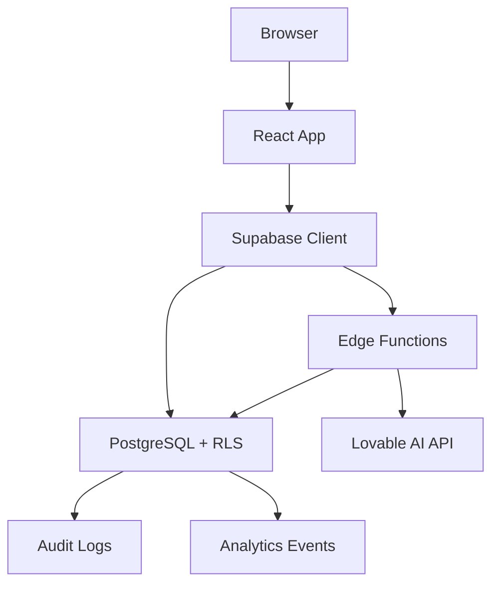
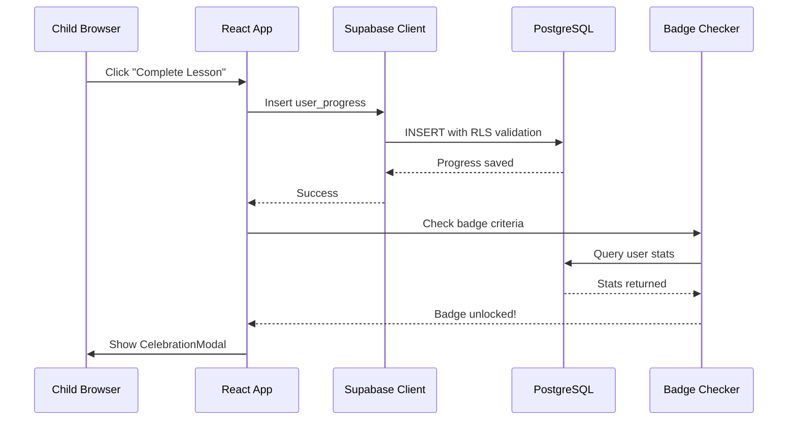
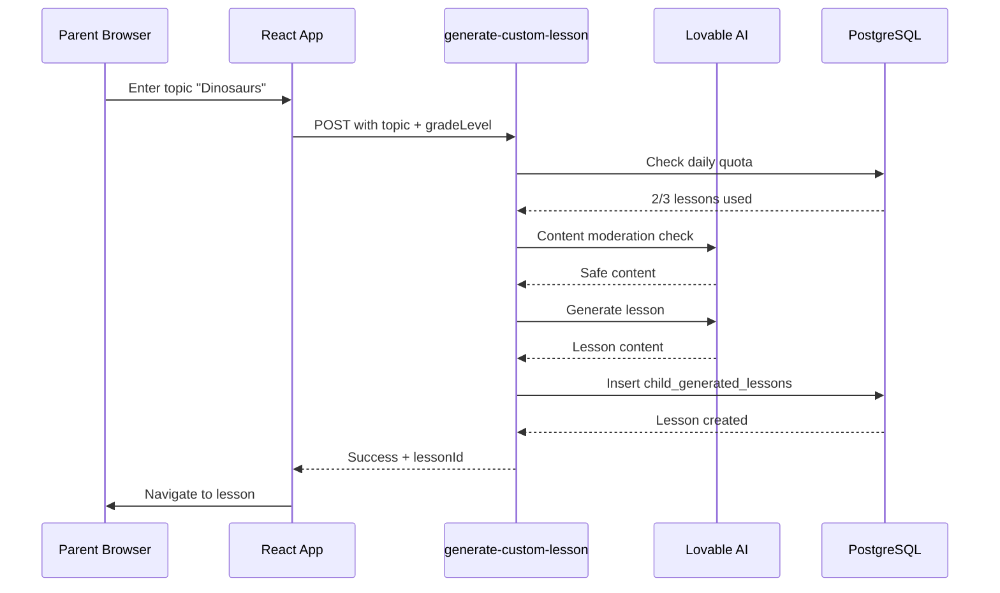
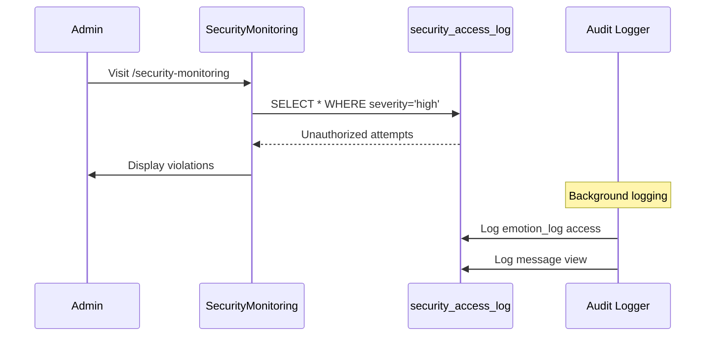
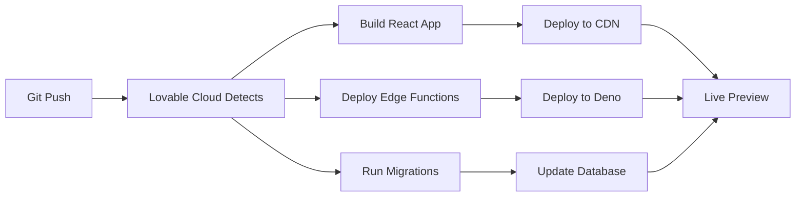

# System Architecture

## Technology Stack Overview

**Frontend:**
- React 18.3 + TypeScript + Vite
- Styling: Tailwind CSS + shadcn/ui components
- State Management: React Query (TanStack Query)
- Routing: React Router DOM v6
- Forms: React Hook Form + Zod validation
- Animations: Framer Motion
- Charts: Recharts

**Backend:**
- Lovable Cloud (Supabase)
- Database: PostgreSQL 15+ with Row Level Security
- Authentication: Supabase Auth (JWT-based)
- Edge Functions: Deno runtime
- AI: Lovable AI (Gemini 2.5 Pro/Flash)

**Infrastructure:**
- Hosting: Lovable Cloud (auto-deploy)
- CDN: Cloudflare
- Monitoring: Lovable Cloud Dashboard
- Version Control: Git

---

## High-Level Architecture



---

## Application Layers

### 1. Presentation Layer (src/pages/, src/components/)

**Public Pages:**
- Landing.tsx - Marketing homepage
- About.tsx - Mission and story
- Features.tsx - Product features
- Pricing.tsx - Pricing plans
- Contact.tsx - Contact form
- Support.tsx - Help center
- Terms.tsx - Terms of service
- Privacy.tsx - Privacy policy

**Authentication Pages:**
- Login.tsx - Email/password login with reCAPTCHA
- SignupForm.tsx - Account creation
- ResetPassword.tsx - Password reset request
- UpdatePassword.tsx - Set new password

**Parent Portal:**
- ParentDashboard.tsx - Parent home screen
- ParentSetup.tsx - Initial onboarding
- Settings.tsx - Account settings
- BetaProgram.tsx - Beta tester info
- BetaAnalytics.tsx - Usage analytics

**Child Portal:**
- ChildDashboard.tsx - Child home screen with age-adaptive UI
- Lessons.tsx - Lesson library (platform + community)
- LessonPlayer.tsx - Lesson viewer with quiz
- LessonDetail.tsx - Lesson preview
- Badges.tsx - Achievement showcase
- Rewards.tsx - Reward catalog
- Social.tsx - Peer connections
- CommunityLessons.tsx - Public lesson library

**Admin Portal:**
- AdminDashboard.tsx - Admin overview
- AdminSetup.tsx - Initial admin configuration
- SecurityMonitoring.tsx - Security audit logs
- BetaFeedbackAdmin.tsx - Beta feedback management
- LessonReview.tsx - Content review workflow
- CreatorDashboard.tsx - Lesson creator analytics
- SystemHealth.tsx - System monitoring

**Specialized Pages:**
- Phase1LessonGeneration.tsx - Batch lesson generator
- SeedLessons.tsx - Lesson seeding interface
- LessonAnalytics.tsx - Lesson engagement stats
- LessonPerformanceAnalytics.tsx - Student performance
- StudentPerformanceReport.tsx - Individual reports

---

### 2. Component Architecture

**Component Categories:**

**admin/** - Admin-specific UI components
- BatchLessonGenerator.tsx - Bulk lesson creation
- ContentReviewDashboard.tsx - Review queue
- Grade2LessonSeedTrigger.tsx - Seed Grade 2 lessons
- KindergartenLessonSeedTrigger.tsx - Seed K lessons
- LessonSeedTrigger.tsx - Generic seeder
- ReviewerPerformance.tsx - Reviewer metrics

**auth/** - Authentication components
- ChildSelector.tsx - Secure child switcher (with server validation)
- LoginForm.tsx - Login form with reCAPTCHA
- PasswordStrengthMeter.tsx - Password validation UI
- SignupForm.tsx - Registration form

**avatar/** - Avatar customization
- AvatarCustomizer.tsx - Avatar editor
- AvatarDisplay.tsx - Avatar renderer

**badges/** - Achievement system
- BadgeShowcase.tsx - Badge gallery

**beta/** - Beta testing features
- BetaTesterBadge.tsx - Beta badge display
- FeedbackWidget.tsx - Bug report widget

**celebration/** - Gamification feedback
- CelebrationModal.tsx - Success animations

**emotional/** - Emotional intelligence
- EmotionCheckIn.tsx - Mood tracker

**error/** - Error handling
- ErrorBoundary.tsx - Global error catcher

**gamification/** - Points and rewards
- LessonTokenDisplay.tsx - Token balance
- PointCounter.tsx - Point animations
- ProgressBar.tsx - Progress visualization
- StreakTracker.tsx - Daily streak display

**layout/** - Page layouts
- AgeAdaptiveNav.tsx - Age-specific navigation
- AppLayout.tsx - Main app wrapper
- MobileOptimized.tsx - Mobile-first layout
- Navigation.tsx - Primary navigation
- ParentLayout.tsx - Parent portal wrapper
- TopBar.tsx - Header bar

**learning/** - Learning activities
- ChallengeModeToggle.tsx - Difficulty switcher
- CollaborativeActivity.tsx - Group learning
- CustomLessonGenerator.tsx - AI lesson creator
- DigitalNotebook.tsx - Student notes
- LessonActionButtons.tsx - Lesson controls
- ReportLessonButton.tsx - Flag content
- RequestShareButton.tsx - Request approval
- SafeMarkdown.tsx - Secure markdown renderer
- ShareLessonModal.tsx - Share dialog

**monitoring/** - System health
- HealthStatus.tsx - Status indicator
- OfflineIndicator.tsx - Offline mode

**notifications/** - Notification system
- NotificationBell.tsx - Notification center

**onboarding/** - User onboarding
- OnboardingTutorial.tsx - Guided tour

**parent/** - Parent dashboard widgets
- AIInsights.tsx - AI-generated insights
- BonusLessonManager.tsx - Grant bonus lessons
- ParentChildMessaging.tsx - In-app messaging
- PendingShareApprovals.tsx - Approve lesson shares
- RewardManagement.tsx - Create rewards
- RewardRedemptions.tsx - Approve redemptions
- ScreenTimeTracker.tsx - Screen time tracking
- WeeklyReportCard.tsx - Weekly summary

**quests/** - Daily quest system
- DailyQuest.tsx - Base quest component
- K2Quest.tsx - K-2 age tier
- Elementary35Quest.tsx - 3-5 age tier
- Middle68Quest.tsx - 6-8 age tier
- High912Quest.tsx - 9-12 age tier

**social/** - Social features
- PeerConnections.tsx - Friend system logic
- PeerConnectionsUI.tsx - Friend list UI
- SharedActivities.tsx - Group activity logic
- SharedActivitiesUI.tsx - Group activity UI

**ui/** - shadcn/ui components (50+ components)
- button.tsx, card.tsx, dialog.tsx, etc.
- Custom: back-button.tsx, loading-spinner.tsx, password-input.tsx, progress-ring.tsx, subject-badge.tsx

---

### 3. Business Logic Layer (src/lib/, src/hooks/)

**Custom Hooks:**

**useAuth.tsx** - Authentication state management
- Manages user session
- Provides signUp(), signIn(), signOut()
- Auto-refreshes tokens

**useValidatedChild.tsx** - Secure child selection
- Server-side validation via RLS
- Prevents localStorage spoofing attacks
- Auto-corrects invalid selections

**usePlatformLessonQuota.tsx** - Daily lesson quota
- Checks base limit (5/day)
- Includes bonus lessons
- Includes tokens (3/week)

**useLessonAnalytics.ts** - Lesson engagement tracking
- Tracks views, saves, shares
- Calculates engagement score

**useRecaptcha.tsx** - reCAPTCHA integration
- Invisible reCAPTCHA v3
- Score-based verification

**use-mobile.tsx** - Responsive breakpoints
- Detects mobile viewport

**use-toast.ts** - Toast notifications
- Global notification system

---

**Utility Libraries:**

**analytics.ts** - Event tracking
```typescript
trackLessonStart(childId, lessonId)
trackLessonComplete(childId, lessonId, score)
trackBadgeUnlock(childId, badgeId)
```

**auditLogger.ts** - Sensitive data access logging
```typescript
logEmotionLogView(emotionLogId, childId)
logMessageView(messageId, childId)
logChildDataView(childId)
logProgressView(progressId, childId)
```

**badgeChecker.ts** - Achievement unlock logic
```typescript
checkStreakBadges(childId, streak)
checkAcademicBadges(childId, subject, score)
checkSocialBadges(childId, peerCount)
```

**emotionEncryption.ts** - E2E encryption for emotion logs
```typescript
encryptEmotionData(trigger, copingStrategy, reflectionNotes)
decryptEmotionData(triggerEncrypted, copingStrategyEncrypted, reflectionNotesEncrypted)
getEncryptionKey() // Derives key from session token
```

**errorHandler.ts** - Global error handling
```typescript
handleError(error, context)
logCriticalError(error, metadata)
```

**inputSanitization.ts** - XSS/injection prevention
```typescript
sanitizeHTML(userInput)
sanitizeMarkdown(userInput)
sanitizeEmail(email)
sanitizeURL(url)
```

**performance.ts** - Core Web Vitals monitoring
```typescript
measureFCP()
measureLCP()
measureCLS()
trackPageLoad(route)
```

**questGenerator.ts** - Daily quest algorithm
```typescript
generateDailyQuest(childId, gradeLevel)
```

**rateLimiter.ts** - Client + server rate limiting
```typescript
checkRateLimit(identifier, maxRequests, windowMs)
checkServerRateLimit(endpoint, maxRequests, windowMinutes)
```

**screenTimeEnforcement.ts** - Daily screen time limits
```typescript
checkScreenTime(childId)
incrementScreenTime(childId, seconds)
```

**validateChild.ts** - Child ownership verification
```typescript
validateChildOwnership(childId)
getFirstChild()
getSafeChildId()
```

**utils.ts** - Common utilities
```typescript
cn(...classes) // Tailwind class merger
formatDate(date)
formatTime(seconds)
```

---

### 4. Data Access Layer (src/integrations/supabase/)

**⚠️ CRITICAL: These files are auto-generated. DO NOT EDIT MANUALLY.**

**client.ts** - Supabase client instance
```typescript
import { supabase } from "@/integrations/supabase/client";
```

**types.ts** - TypeScript types from database schema
```typescript
import type { Database } from "@/integrations/supabase/types";
type Lesson = Database['public']['Tables']['lessons']['Row'];
```

---

### 5. Backend Layer (supabase/functions/)

**Edge Functions:**

**ai-insights/** - AI-powered parent insights
- Model: google/gemini-2.5-pro
- Analyzes recent activity, emotions, performance
- Generates personalized insights

**batch-lesson-generation/** - Bulk lesson seeding
- Admin-only
- Generates multiple lessons in one call
- Model: google/gemini-2.5-pro

**generate-custom-lesson/** - AI custom lesson generator
- Model: google/gemini-2.5-pro
- Content moderation check (gemini-2.5-flash)
- Rate limit: 3/day per child
- Quota enforcement

**generate-lesson-content/** - Platform lesson generator
- Admin-only
- Structured lesson generation

**generate-weekly-reports/** - Automated weekly emails
- Runs Sunday 8 PM (cron job)
- Aggregates week's progress
- Generates insights per child

**health-check/** - System health monitoring
- Public endpoint (no auth)
- Returns: status, timestamp, version

**request-lesson-share/** - Lesson sharing workflow
- Changes share_status to 'pending_approval'
- Creates lesson_reviews record
- Auto-assigns reviewer

**seed-kindergarten-lessons/** - Seed 50 K lessons
- Admin-only
- Reads from docs/kindergarten-lesson-outlines.md
- Inserts into lessons table

**seed-grade-2-lessons/** - Seed 50 Grade 2 lessons
- Admin-only
- Reads from docs/grade-2-lesson-outlines.md

**seed-lessons/** - Generic lesson seeder
- Admin-only
- Flexible seeding tool

**track-lesson-analytics/** - Lesson engagement tracking
- Tracks views, saves, shares
- Updates lesson_analytics table
- Awards creator points

**verify-recaptcha/** - reCAPTCHA server-side verification
- Public endpoint (no auth)
- Validates reCAPTCHA v3 tokens
- Returns score (0-1)

---

### 6. Database Layer (PostgreSQL + RLS)

**Core Tables:**

**User Management:**
- profiles - Parent accounts
- user_roles - RBAC (parent, admin, moderator)
- children - Child profiles

**Learning Content:**
- lessons - Platform lessons (read-only for users)
- child_generated_lessons - User-created lessons
- user_progress - Completion tracking

**Gamification:**
- achievement_badges - Badge definitions
- user_badges - Badge unlocks
- daily_lesson_quota - Daily limits
- lesson_tokens - Redeemable tokens
- creator_rewards - Lesson creator gamification

**Rewards System:**
- rewards - Parent-defined rewards
- reward_redemptions - Child requests

**Social Features:**
- peer_connections - Friend system
- collaboration_requests - Peer learning
- shared_activities - Group activities
- activity_participants - Activity members

**Communication:**
- parent_child_messages - In-app messaging
- parent_weekly_reports - Auto-generated emails

**Analytics & Security:**
- analytics_events - Event tracking
- security_access_log - Audit logs
- lesson_analytics - Lesson engagement
- lesson_analytics_events - Raw events

**Content Review:**
- lesson_reviews - Review workflow
- review_history - Status change audit
- reviewer_performance - Reviewer metrics

**Rate Limiting:**
- api_rate_limits - Rate limit tracking
- rate_limit_violations - Violation logs
- collaboration_rate_limit - Collaboration limits
- idempotency_cache - Duplicate prevention

**Beta Testing:**
- beta_feedback - Bug reports

---

## Data Flow Examples

### Lesson Completion Flow



**Steps:**
1. Child clicks "Complete Lesson" → LessonPlayer.tsx
2. Submit completion → supabase.from('user_progress').insert()
3. RLS validates child_id ownership (parent_id = auth.uid())
4. Database trigger updates lesson_performance_metrics
5. Badge checker evaluates unlock criteria
6. If badge earned, insert into user_badges
7. Celebrate with CelebrationModal.tsx
8. Update daily_lesson_quota counter
9. Track analytics → track-lesson-analytics edge function

---

### Custom Lesson Generation Flow



**Steps:**
1. Parent enters topic → CustomLessonGenerator.tsx
2. Check daily quota (3/day) → usePlatformLessonQuota()
3. Rate limit check (10/day/family) → checkServerRateLimit()
4. Call generate-custom-lesson edge function
5. Content moderation with Lovable AI (gemini-2.5-flash)
6. Generate lesson with gemini-2.5-pro (2000 tokens)
7. Store in child_generated_lessons table (share_status='private')
8. Decrement quota counter
9. Display lesson in dashboard

---

### Security Audit Flow



**Steps:**
1. Admin visits /security-monitoring
2. Load security_access_log data
3. Display:
   - Unauthorized access attempts
   - Rate limit violations
   - Sensitive data access patterns
   - Failed authentication logs
4. Filter by severity, user, date range
5. Export CSV for incident response

---

## Security Architecture

### Multi-Layered Defense

**Layer 1: Network**
- HTTPS only, no HTTP fallback
- Cloudflare DDoS protection
- Rate limiting at edge

**Layer 2: Authentication**
- Supabase Auth (JWT tokens)
- reCAPTCHA v3 on auth forms
- Auto token refresh (60 min)
- Secure password hashing (bcrypt)

**Layer 3: Authorization**
- Row Level Security (RLS) policies
- RBAC (parent, admin, moderator)
- Server-side validation (useValidatedChild)

**Layer 4: Application**
- Input sanitization (all user inputs)
- XSS prevention (DOMPurify)
- SQL injection prevention (parameterized queries)
- Rate limiting (client + server)

**Layer 5: Audit**
- Access logging (sensitive tables)
- Security monitoring dashboard
- Incident response procedures

---

## Performance Optimization

### Frontend Optimization

**Code Splitting:**
- React.lazy() for large components
- Dynamic imports for routes
- Vendor code chunking

**Asset Optimization:**
- Image lazy loading
- WebP format
- Responsive images (srcset)
- CSS purging (unused Tailwind)

**Caching:**
- React Query caching (5 min default)
- Browser caching (Cache-Control headers)
- Service worker (PWA - future)

**Bundle Size:**
- Tree shaking enabled
- Import only used components
- Avoid large dependencies

### Database Optimization

**Indexes:**
- All foreign keys indexed
- Composite indexes for common queries
- Partial indexes for filtered queries

**Query Optimization:**
- SELECT only needed columns
- LIMIT result sets
- Use .single() when expecting one row
- Use .maybeSingle() when row might not exist

**Materialized Views:**
- lesson_review_dashboard
- student_lesson_performance
- Refreshed hourly

---

## Deployment Architecture

### CI/CD Pipeline



**Steps:**
1. Developer pushes to Git
2. Lovable Cloud detects changes
3. Parallel execution:
   - Build React app (Vite)
   - Deploy edge functions (Deno)
   - Run database migrations
4. Deploy to production
5. Health checks
6. Notify team (success/failure)

---

## Scalability Considerations

### Current Capacity
- **Users:** 10,000+ parents
- **Children:** 30,000+ students
- **Lessons:** 1,000,000+ completions/month
- **API Calls:** 5,000,000+ requests/month

### Scaling Strategy

**Horizontal Scaling:**
- Lovable Cloud auto-scales
- No manual intervention needed

**Database Scaling:**
- Read replicas for analytics queries
- Connection pooling (Supabase default)
- Query optimization (indexes)

**Edge Function Scaling:**
- Auto-scales with demand
- Deno isolates per request
- Sub-100ms cold starts

---

## Monitoring & Observability

### Metrics Tracked

**Performance:**
- Core Web Vitals (FCP, LCP, CLS)
- API response times (p50, p95, p99)
- Database query times
- Edge function execution time

**Availability:**
- Uptime (99.9% SLA)
- Error rates
- Failed requests

**Business:**
- Daily active users
- Lesson completion rate
- Badge unlock rate
- Custom lesson generation

**Security:**
- Failed authentication attempts
- Rate limit violations
- Unauthorized access attempts

### Alerting Thresholds

**Critical:**
- API error rate >5%
- Database downtime
- Authentication failures >10/min

**High:**
- API response time >2s (p95)
- Failed edge functions >10%

**Medium:**
- Memory usage >80%
- Disk usage >70%

---

## Future Architecture Enhancements

**Phase 2: Multi-Tenancy**
- School accounts (multiple families)
- Teacher portals
- Bulk user management

**Phase 3: Mobile Apps**
- React Native (iOS + Android)
- Offline mode (IndexedDB)
- Push notifications

**Phase 4: AI Enhancement**
- Real-time tutoring chatbot
- Voice-to-text for lessons
- Personalized learning paths

**Phase 5: Integration Ecosystem**
- Google Classroom sync
- Canvas LMS integration
- Third-party content providers

---

## Key Architectural Decisions

### Decision 1: Lovable Cloud vs Self-Hosted Supabase
**Chosen:** Lovable Cloud  
**Rationale:**
- Zero DevOps overhead
- Auto-scaling included
- Integrated deployment pipeline
- Cost-effective for beta phase

### Decision 2: Deno Edge Functions vs Node.js Lambdas
**Chosen:** Deno Edge Functions  
**Rationale:**
- Faster cold starts (<100ms)
- Built-in TypeScript support
- Secure by default (no file system access)
- V8 isolates (better than containers)

### Decision 3: React Query vs Redux
**Chosen:** React Query  
**Rationale:**
- Automatic caching + refetching
- Less boilerplate
- Server state management built-in
- Optimistic updates out-of-box

### Decision 4: Row Level Security vs Application-Level Auth
**Chosen:** Row Level Security  
**Rationale:**
- Defense in depth (cannot be bypassed)
- Enforced at database level
- No trust in application code
- Audit trail at database level

---

## Glossary

**RLS:** Row Level Security - Database-level access control  
**JWT:** JSON Web Token - Authentication token format  
**RBAC:** Role-Based Access Control - Permission system  
**E2E:** End-to-End - Full encryption from client to storage  
**COPPA:** Children's Online Privacy Protection Act  
**FERPA:** Family Educational Rights and Privacy Act  
**PWA:** Progressive Web App - Installable web application  
**SLA:** Service Level Agreement - Uptime guarantee  
**CDN:** Content Delivery Network - Global edge caching
