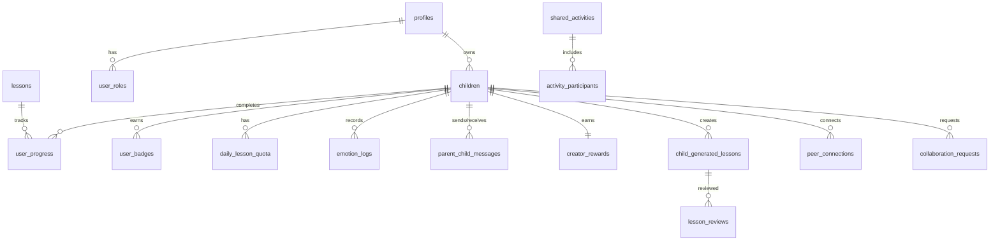

# Database Schema Documentation

## Entity Relationship Overview



---

## Core Tables

### profiles
Parent/guardian accounts linked to Supabase Auth.

| Column | Type | Constraints | Description |
|--------|------|-------------|-------------|
| id | uuid | PK, FK → auth.users | User ID from Supabase Auth |
| full_name | text | NOT NULL | Parent's full name |
| onboarding_completed | boolean | DEFAULT false | Tutorial completion status |
| created_at | timestamptz | DEFAULT now() | Account creation timestamp |
| updated_at | timestamptz | DEFAULT now() | Last profile update |

**RLS Policies:**
- Users can only view/update their own profile
- Enforced: `id = auth.uid()`

**Relationships:**
- 1 profile → many children
- 1 profile → many user_roles
- 1 profile → many rewards
- 1 profile → many parent_child_messages

---

### user_roles
Role-based access control (RBAC) for multi-tenant permissions.

| Column | Type | Constraints | Description |
|--------|------|-------------|-------------|
| id | uuid | PK | Unique role assignment ID |
| user_id | uuid | FK → auth.users, NOT NULL | User receiving role |
| role | app_role | NOT NULL | Enum: parent, admin, moderator |
| created_at | timestamptz | DEFAULT now() | Role granted timestamp |
| expires_at | timestamptz | NULL | Optional expiration date |

**Unique Constraint:** `(user_id, role)` - Prevent duplicate role assignments

**RLS Policies:**
- Only admins can assign/revoke roles: `is_current_user_admin()`
- Users can view their own roles: `user_id = auth.uid()`

**Audit:**
- `log_role_change()` trigger logs all changes to `role_audit_log`

**Functions:**
- `has_role(user_id, role)` - Check if user has specific role
- `has_permission(user_id, required_role)` - Check permission with hierarchy (admin > moderator > parent)
- `add_admin_role(email)` - Grant admin role by email (admin-only)

---

### children
Child accounts managed by parents.

| Column | Type | Constraints | Description |
|--------|------|-------------|-------------|
| id | uuid | PK | Unique child ID |
| parent_id | uuid | FK → profiles(id), NOT NULL | Parent owner |
| name | text | NOT NULL | Child's name (first name only) |
| grade_level | integer | NOT NULL, 0-12 | Academic grade (0=Kindergarten) |
| avatar_config | jsonb | DEFAULT {} | Avatar customization JSON |
| total_points | integer | DEFAULT 0 | Lifetime points earned |
| daily_screen_time_limit_minutes | integer | DEFAULT 60 | Max daily screen time |
| screen_time_enabled | boolean | DEFAULT true | Enforce screen time limits? |
| challenge_mode_enabled | boolean | DEFAULT false | Harder difficulty enabled? |
| weekly_report_enabled | boolean | DEFAULT true | Send weekly email reports? |
| daily_quest_id | uuid | NULL | Today's quest lesson ID |
| quest_completed_at | timestamptz | NULL | Quest completion timestamp |
| quest_bonus_points | integer | DEFAULT 0 | Quest reward points |
| pin_hash | text | NULL | Hashed PIN for child login |
| created_at | timestamptz | DEFAULT now() | Child profile creation |

**RLS Policies:**
- Parents can CRUD their own children: `parent_id = auth.uid()`
- Admins can view all children: `has_role(auth.uid(), 'admin')`

**Indexes:**
- `children(parent_id)` - Parent dashboard queries
- `children(grade_level)` - Lesson filtering

**Relationships:**
- 1 child → many user_progress
- 1 child → many user_badges
- 1 child → many child_generated_lessons
- 1 child → many peer_connections (as both child and peer)
- 1 child → 1 creator_rewards

**Security:**
- `logChildDataView(childId)` audit function logs parent access

---

### lessons
Platform-generated lessons (read-only for users).

| Column | Type | Constraints | Description |
|--------|------|-------------|-------------|
| id | uuid | PK | Unique lesson ID |
| title | text | NOT NULL | Lesson title |
| subject | text | NOT NULL | reading, math, science, social_studies, etc. |
| grade_level | integer | NOT NULL, 0-12 | Target grade level |
| description | text | NULL | Brief lesson summary |
| content_markdown | text | NOT NULL | Full lesson content (Markdown) |
| quiz_questions | jsonb | NULL | Assessment questions array |
| estimated_minutes | integer | DEFAULT 15 | Expected completion time |
| points_value | integer | DEFAULT 50 | Points awarded on completion |
| difficulty | text | NULL | easy, medium, hard |
| standards_alignment | text | NULL | Common Core/state standards |
| thumbnail_url | text | NULL | Lesson preview image |
| differentiation | jsonb | DEFAULT {} | {support: "", extension: ""} |
| is_active | boolean | DEFAULT true | Published and visible? |
| created_at | timestamptz | DEFAULT now() | Lesson creation timestamp |

**RLS Policies:**
- Authenticated users can view active lessons: `is_active = true AND auth.role() = 'authenticated'`
- No INSERT/UPDATE/DELETE for users (admin-only via backend)

**Indexes:**
- `lessons(grade_level, is_active)` - Lesson library queries
- `lessons(subject, grade_level, is_active)` - Subject filtering

**Relationships:**
- 1 lesson → many user_progress
- 1 lesson → 1 lesson_analytics (optional)
- 1 lesson → many lesson_analytics_events

---

### child_generated_lessons
User-created custom lessons with parent approval workflow.

| Column | Type | Constraints | Description |
|--------|------|-------------|-------------|
| id | uuid | PK | Unique lesson ID |
| child_id | uuid | FK → children(id), NOT NULL | Creator child (for ownership) |
| creator_child_id | uuid | FK → children(id), NULL | Public creator ID (for attribution) |
| parent_id | uuid | FK → profiles(id), NOT NULL | Parent owner |
| title | text | NOT NULL | Lesson title |
| subject | text | NOT NULL | Subject category |
| grade_level | integer | NOT NULL, 0-12 | Target grade level |
| description | text | NULL | Brief lesson summary |
| content_markdown | text | NOT NULL | Lesson content (Markdown) |
| quiz_questions | jsonb | NULL | Assessment questions |
| generation_prompt | text | NULL | Original AI prompt |
| estimated_minutes | integer | DEFAULT 15 | Duration estimate |
| points_value | integer | DEFAULT 50 | Reward points |
| difficulty | text | NULL | easy, medium, hard |
| share_status | text | DEFAULT 'private' | private, pending_approval, public, rejected |
| parent_approved_at | timestamptz | NULL | Approval timestamp |
| parent_approved_by | uuid | NULL | Approving parent ID |
| rejection_reason | text | NULL | Why rejected (if applicable) |
| times_used | integer | DEFAULT 0 | Usage counter (public lessons) |
| is_active | boolean | DEFAULT true | Soft delete flag |
| created_at | timestamptz | DEFAULT now() | Creation timestamp |
| updated_at | timestamptz | DEFAULT now() | Last modification |

**RLS Policies:**
- Parents can CRUD their children's lessons: `parent_id = auth.uid()`
- Public lessons visible to all: `share_status = 'public' AND is_active = true`
- Anyone can increment `times_used` for public lessons (special policy)

**Indexes:**
- `child_generated_lessons(child_id, parent_id)` - Creator dashboard
- `child_generated_lessons(share_status, is_active, grade_level)` - Community lessons
- `child_generated_lessons(creator_child_id)` - Creator attribution

**Triggers:**
- `trigger_award_approval_points()` - Award 10 creator points on public approval
- `create_review_for_new_lesson()` - Auto-create lesson review record

**Relationships:**
- 1 child_generated_lesson → 1 lesson_reviews (optional)
- 1 child_generated_lesson → many lesson_analytics_events

---

### user_progress
Lesson completion and performance tracking.

| Column | Type | Constraints | Description |
|--------|------|-------------|-------------|
| id | uuid | PK | Unique progress record |
| child_id | uuid | FK → children(id), NOT NULL | Student |
| lesson_id | uuid | FK → lessons(id), NOT NULL | Lesson (platform or custom) |
| status | text | DEFAULT 'not_started' | not_started, in_progress, completed |
| score | integer | NULL, 0-100 | Quiz score percentage |
| time_spent_seconds | integer | DEFAULT 0 | Time tracking |
| completed_at | timestamptz | NULL | Completion timestamp |
| created_at | timestamptz | DEFAULT now() | Started timestamp |

**RLS Policies:**
- Parents can view/manage progress for their children:
  ```sql
  child_id IN (SELECT id FROM children WHERE parent_id = auth.uid())
  ```

**Indexes:**
- `user_progress(child_id, status)` - Dashboard stats
- `user_progress(child_id, completed_at)` - Streak calculation
- `user_progress(lesson_id)` - Lesson analytics

**Triggers:**
- Updates `lesson_performance_metrics` materialized view
- Updates `student_lesson_performance` aggregates

**Functions:**
- `calculate_streak(child_id)` - Calculate consecutive days with completed lessons

---

## Gamification Tables

### achievement_badges
Badge definitions (master list).

| Column | Type | Constraints | Description |
|--------|------|-------------|-------------|
| id | uuid | PK | Unique badge definition |
| badge_id | text | UNIQUE, NOT NULL | Badge identifier (e.g., "streak_7") |
| name | text | NOT NULL | Display name |
| description | text | NOT NULL | How to unlock |
| category | text | NOT NULL | academic, social, streak, creativity, etc. |
| tier | text | DEFAULT 'bronze' | bronze, silver, gold, platinum |
| icon | text | NOT NULL | Lucide icon name |
| unlock_criteria | jsonb | NOT NULL | {type, threshold, ...} |
| points_reward | integer | DEFAULT 0 | Bonus points on unlock |
| is_active | boolean | DEFAULT true | Published? |
| created_at | timestamptz | DEFAULT now() | Badge creation |

**RLS Policies:**
- All authenticated users can view active badges: `is_active = true`

**Example unlock_criteria:**
```json
{
  "type": "streak",
  "threshold": 7,
  "description": "Complete lessons 7 days in a row"
}
```

---

### user_badges
Achievement unlocks per child.

| Column | Type | Constraints | Description |
|--------|------|-------------|-------------|
| id | uuid | PK | Unique unlock record |
| child_id | uuid | FK → children(id), NOT NULL | Badge earner |
| badge_id | text | FK → achievement_badges(badge_id), NOT NULL | Badge identifier |
| earned_at | timestamptz | DEFAULT now() | Unlock timestamp |
| progress | integer | DEFAULT 100 | Progress percentage (100 = unlocked) |

**Unique Constraint:** `(child_id, badge_id)` - Prevent duplicate unlocks

**RLS Policies:**
- Parents can insert badges for their children
- Parents can view their children's badges

**Relationships:**
- 1 user_badge → 1 achievement_badges (lookup)

---

### daily_lesson_quota
Daily lesson limits and bonus grants.

| Column | Type | Constraints | Description |
|--------|------|-------------|-------------|
| id | uuid | PK | Unique quota record |
| child_id | uuid | FK → children(id), NOT NULL | Child |
| quota_date | date | NOT NULL | Date for this quota |
| platform_lessons_completed | integer | DEFAULT 0 | Platform lessons today |
| bonus_lessons_granted | integer | DEFAULT 0 | Extra lessons from parent |
| custom_lessons_completed | integer | DEFAULT 0 | Custom lessons generated today |
| created_at | timestamptz | DEFAULT now() | Record creation |
| updated_at | timestamptz | DEFAULT now() | Last update |

**Unique Constraint:** `(child_id, quota_date)`

**RLS Policies:**
- Parents can manage quotas for their children

**Base Limits:**
- Platform lessons: 5/day (base)
- Custom lesson generation: 3/day (enforced in edge function)
- Bonus lessons: Parent can grant unlimited

**Functions:**
- `check_platform_lesson_quota(child_id)` - Check current quota status

---

### lesson_tokens
Redeemable lesson unlock tokens (reward system).

| Column | Type | Constraints | Description |
|--------|------|-------------|-------------|
| id | uuid | PK | Unique token record |
| child_id | uuid | FK → children(id), NOT NULL | Token owner |
| tokens_available | integer | DEFAULT 3 | Current token balance |
| tokens_used | integer | DEFAULT 0 | Lifetime tokens used |
| last_reset_date | date | DEFAULT CURRENT_DATE | Last weekly reset |
| created_at | timestamptz | DEFAULT now() | Record creation |

**RLS Policies:**
- Parents can view/manage their children's tokens

**Reset Logic:**
- Tokens reset to 3 every 7 days (weekly)
- Used to bypass daily lesson limits
- Parents cannot directly grant tokens (system-managed)

---

### creator_rewards
Gamification for lesson creators (children who share lessons).

| Column | Type | Constraints | Description |
|--------|------|-------------|-------------|
| id | uuid | PK | Unique reward record |
| child_id | uuid | FK → children(id), UNIQUE, NOT NULL | Creator child |
| total_points | integer | DEFAULT 0 | Lifetime creator points |
| level | integer | DEFAULT 1 | Creator level (1-4) |
| badges | text[] | DEFAULT '{}' | Array of creator badges |
| created_at | timestamptz | DEFAULT now() | Record creation |
| updated_at | timestamptz | DEFAULT now() | Last update |

**RLS Policies:**
- Parents can view their children's rewards
- Public leaderboard access (all authenticated users)

**Point Values:**
- Lesson view: 1 point
- Lesson saved: 3 points
- Lesson shared: 5 points
- Lesson approved for public: 10 points

**Level Thresholds:**
- Level 1: 0-499 points
- Level 2: 500-1499 points → "Rising Creator" badge
- Level 3: 1500-4999 points → "Top Educator" badge
- Level 4: 5000+ points → "Master Instructor" badge

**Functions:**
- `award_creator_points(child_id, points, reason, lesson_id)` - Award points
- `calculate_creator_level(points)` - Determine level from points

**Triggers:**
- `trigger_award_approval_points()` - Auto-award on lesson approval
- `trigger_award_analytics_points()` - Auto-award on analytics events

---

### creator_reward_history
Audit log for creator point transactions.

| Column | Type | Constraints | Description |
|--------|------|-------------|-------------|
| id | uuid | PK | Unique transaction |
| child_id | uuid | FK → children(id), NOT NULL | Creator child |
| points_change | integer | NOT NULL | Points delta (+/-) |
| reason | text | NOT NULL | Why points awarded/deducted |
| lesson_id | uuid | FK → child_generated_lessons(id), NULL | Related lesson (optional) |
| created_at | timestamptz | DEFAULT now() | Transaction timestamp |

**RLS Policies:**
- Parents can view their children's reward history

---

## Rewards System Tables

### rewards
Parent-defined custom rewards children can redeem.

| Column | Type | Constraints | Description |
|--------|------|-------------|-------------|
| id | uuid | PK | Unique reward |
| parent_id | uuid | FK → profiles(id), NOT NULL | Reward creator |
| name | text | NOT NULL | Reward name (e.g., "30 min video game time") |
| description | text | NULL | Detailed description |
| points_cost | integer | NOT NULL | Points required to redeem |
| is_active | boolean | DEFAULT true | Available for redemption? |
| redemption_count | integer | DEFAULT 0 | Times redeemed (all children) |
| created_at | timestamptz | DEFAULT now() | Reward creation |

**RLS Policies:**
- Parents can CRUD their own rewards: `parent_id = auth.uid()`
- Children can view active rewards of their parent

**Examples:**
- "30 minutes extra screen time" - 100 points
- "Choose dinner" - 50 points
- "Stay up 30 minutes late" - 75 points
- "Trip to ice cream shop" - 200 points

---

### reward_redemptions
Child reward redemption requests.

| Column | Type | Constraints | Description |
|--------|------|-------------|-------------|
| id | uuid | PK | Unique redemption |
| child_id | uuid | FK → children(id), NOT NULL | Redeemer |
| reward_id | uuid | FK → rewards(id), NOT NULL | Reward requested |
| parent_id | uuid | FK → profiles(id), NULL | Parent approver |
| status | text | DEFAULT 'pending' | pending, approved, rejected |
| requested_at | timestamptz | DEFAULT now() | Request timestamp |
| resolved_at | timestamptz | NULL | Approval/rejection timestamp |
| parent_notes | text | NULL | Notes from parent |

**RLS Policies:**
- Parents can manage children's redemptions (CRUD)
- Children can view their own redemptions

**Workflow:**
1. Child requests redemption (points deducted immediately)
2. Parent receives notification
3. Parent approves/rejects in dashboard
4. If rejected, points refunded

---

## Social Features Tables

### peer_connections
Child-to-child friendships (parent-approved).

| Column | Type | Constraints | Description |
|--------|------|-------------|-------------|
| id | uuid | PK | Unique connection |
| child_id | uuid | FK → children(id), NOT NULL | Requester |
| peer_id | uuid | FK → children(id), NOT NULL | Recipient |
| status | text | DEFAULT 'pending' | pending, accepted, blocked |
| requested_at | timestamptz | DEFAULT now() | Request timestamp |
| accepted_at | timestamptz | NULL | Acceptance timestamp |

**RLS Policies:**
- Parents can CRUD connections for their children

**Business Rules:**
- No self-connections (enforced in application)
- Parents must approve connection requests
- Both parents can see pending requests

---

### collaboration_requests
Peer learning session requests with anti-spam protections.

| Column | Type | Constraints | Description |
|--------|------|-------------|-------------|
| id | uuid | PK | Unique request |
| requester_child_id | uuid | FK → children(id), NOT NULL | Requesting child |
| recipient_child_id | uuid | FK → children(id), NOT NULL | Target child |
| lesson_id | uuid | FK → lessons(id), NULL | Optional lesson context |
| status | text | DEFAULT 'pending' | pending, accepted, rejected, expired |
| parent_approved | boolean | DEFAULT false | Parent consent given? |
| created_at | timestamptz | DEFAULT now() | Request timestamp |
| approved_at | timestamptz | NULL | Approval timestamp |

**RLS Policies:**
- Parents can create requests for their children
- Parents can approve requests targeting their children
- Parents can view requests involving their children

**Rate Limiting:**
- 10 requests per 15 minutes per family
- Enforced by `request_collaboration()` function
- Uses `collaboration_rate_limit` table for tracking
- Advisory locks prevent race conditions

**Functions:**
- `request_collaboration(child_id, target_id, lesson_id, idempotency_key)` - Create request with protections

**Security:**
- No self-collaboration
- Duplicate pending requests blocked
- Idempotency cache prevents duplicate submissions

---

### shared_activities
Group learning activities (2-4 children).

| Column | Type | Constraints | Description |
|--------|------|-------------|-------------|
| id | uuid | PK | Unique activity |
| activity_type | text | NOT NULL | quiz, discussion, project, game |
| title | text | NOT NULL | Activity name |
| description | text | NULL | Activity details |
| lesson_id | uuid | FK → lessons(id), NULL | Related lesson (optional) |
| created_by | uuid | FK → children(id), NOT NULL | Creator child |
| content | jsonb | DEFAULT '{}' | Activity-specific data |
| max_participants | integer | DEFAULT 4 | Participant limit |
| status | text | DEFAULT 'open' | open, in_progress, completed |
| started_at | timestamptz | NULL | Activity start time |
| completed_at | timestamptz | NULL | Completion time |
| created_at | timestamptz | DEFAULT now() | Creation timestamp |

**RLS Policies:**
- Children can create shared activities
- Children can view activities they created or joined

---

### activity_participants
Tracks participants in shared activities.

| Column | Type | Constraints | Description |
|--------|------|-------------|-------------|
| id | uuid | PK | Unique participation |
| activity_id | uuid | FK → shared_activities(id), NOT NULL | Activity |
| child_id | uuid | FK → children(id), NOT NULL | Participant |
| joined_at | timestamptz | DEFAULT now() | Join timestamp |
| contribution | jsonb | DEFAULT '{}' | Participant's work |
| status | text | DEFAULT 'active' | active, left, removed |

**RLS Policies:**
- Children can join activities (INSERT)
- Children can update their own participation

---

## Communication Tables

### parent_child_messages
In-app messaging between parents and children.

| Column | Type | Constraints | Description |
|--------|------|-------------|-------------|
| id | uuid | PK | Unique message |
| parent_id | uuid | FK → profiles(id), NOT NULL | Parent sender/recipient |
| child_id | uuid | FK → children(id), NOT NULL | Child sender/recipient |
| sender_type | text | NOT NULL | parent, child |
| message_type | text | DEFAULT 'text' | text, sticker, voice (future) |
| message_text | text | NOT NULL | Message content |
| reaction | text | NULL | Emoji reaction (optional) |
| is_important | boolean | DEFAULT false | Pin message? |
| read_at | timestamptz | NULL | Read timestamp |
| created_at | timestamptz | DEFAULT now() | Send timestamp |

**RLS Policies:**
- Parents can insert messages: `parent_id = auth.uid() AND child_id IN (SELECT id FROM children WHERE parent_id = auth.uid())`
- Parents and children can view their conversation
- Parents and children can update (for read_at, reaction)

**Security:**
- `logMessageView()` audit function logs access
- Messages stored as plain text (not encrypted)
- No external sharing allowed

---

### parent_weekly_reports
Auto-generated weekly progress emails.

| Column | Type | Constraints | Description |
|--------|------|-------------|-------------|
| id | uuid | PK | Unique report |
| parent_id | uuid | FK → profiles(id), NOT NULL | Recipient parent |
| child_id | uuid | FK → children(id), NOT NULL | Subject child |
| week_start_date | date | NOT NULL | Week start (Monday) |
| lessons_completed | integer | DEFAULT 0 | Weekly lesson count |
| total_points_earned | integer | DEFAULT 0 | Weekly points |
| strongest_subject | text | NULL | Best performance subject |
| growth_area | text | NULL | Subject needing improvement |
| top_achievement | text | NULL | Highlight accomplishment |
| conversation_starter | text | NULL | Parent-child discussion prompt |
| report_data | jsonb | DEFAULT '{}' | Full report JSON |
| sent_at | timestamptz | DEFAULT now() | Email sent timestamp |

**RLS Policies:**
- Parents can only view their own reports: `parent_id = auth.uid()`

**Generated By:**
- `generate-weekly-reports` edge function
- Runs every Sunday at 8 PM (cron job)
- Aggregates data from `user_progress`, `user_badges`, `analytics_events`

---

## Analytics & Security Tables

### analytics_events
Privacy-safe event tracking (no PII).

| Column | Type | Constraints | Description |
|--------|------|-------------|-------------|
| id | uuid | PK | Unique event |
| child_id | uuid | FK → children(id), NOT NULL | Event actor |
| event_type | text | NOT NULL | lesson_start, lesson_complete, badge_unlock, etc. |
| event_category | text | NULL | learning, gamification, social |
| event_properties | jsonb | DEFAULT '{}' | Event metadata (no PII) |
| timestamp | timestamptz | DEFAULT now() | Event timestamp |

**RLS Policies:**
- Parents can insert events for their children
- Parents and admins can view events

**Privacy Rules:**
- No IP addresses
- No device fingerprinting
- No location data
- No PII in event_properties

**Example Events:**
```json
{
  "event_type": "lesson_complete",
  "event_category": "learning",
  "event_properties": {
    "lesson_id": "uuid",
    "score": 95,
    "time_spent_seconds": 600
  }
}
```

---

### security_access_log
Audit log for sensitive data access (COPPA/FERPA compliance).

| Column | Type | Constraints | Description |
|--------|------|-------------|-------------|
| id | uuid | PK | Unique log entry |
| user_id | uuid | FK → auth.users, NULL | User who accessed |
| accessed_table | text | NOT NULL | Table name accessed |
| accessed_record_id | uuid | NULL | Record ID (if applicable) |
| access_type | text | NOT NULL | view, insert, update, delete |
| ip_address | text | NULL | User IP address |
| user_agent | text | NULL | Browser user agent |
| success | boolean | DEFAULT true | Access granted? |
| error_message | text | NULL | Error if access denied |
| metadata | jsonb | DEFAULT '{}' | Additional context |
| accessed_at | timestamptz | DEFAULT now() | Access timestamp |

**RLS Policies:**
- Admins can view all logs: `has_role(auth.uid(), 'admin')`
- Users can view their own logs: `user_id = auth.uid()`

**Logged Tables:**
- `emotion_logs` - Mental health data
- `parent_child_messages` - Private communications
- `children` - Child PII
- `user_progress` - Educational records

**Triggers:**
- `trigger_log_access()` on INSERT/UPDATE/DELETE to logged tables

**Functions:**
- `log_sensitive_access(table_name, record_id, access_type)` - Manual logging

---

### lesson_analytics
Aggregated lesson engagement metrics.

| Column | Type | Constraints | Description |
|--------|------|-------------|-------------|
| id | uuid | PK | Unique analytics record |
| lesson_id | uuid | FK → child_generated_lessons(id), UNIQUE, NOT NULL | Lesson being tracked |
| total_views | integer | DEFAULT 0 | Total view count |
| unique_viewers | integer | DEFAULT 0 | Distinct child viewers |
| total_saves | integer | DEFAULT 0 | Save/bookmark count |
| total_shares | integer | DEFAULT 0 | Share count |
| avg_time_seconds | integer | DEFAULT 0 | Average time spent |
| engagement_score | numeric | DEFAULT 0 | Calculated metric |
| created_at | timestamptz | DEFAULT now() | Record creation |
| updated_at | timestamptz | DEFAULT now() | Last update |

**RLS Policies:**
- Creators can view their own lesson analytics

**Functions:**
- `calculate_engagement_score(views, saves, shares, unique_viewers)` - Calculate metric

**Triggers:**
- `update_lesson_analytics()` - Auto-update on new analytics events

---

### lesson_analytics_events
Raw analytics events for lessons.

| Column | Type | Constraints | Description |
|--------|------|-------------|-------------|
| id | uuid | PK | Unique event |
| lesson_id | uuid | FK → child_generated_lessons(id), NOT NULL | Lesson |
| child_id | uuid | FK → children(id), NOT NULL | Event actor |
| event_type | text | NOT NULL | view, save, share |
| created_at | timestamptz | DEFAULT now() | Event timestamp |

**RLS Policies:**
- Authenticated users can track analytics (INSERT)
- Creators can view their lesson analytics events

**Triggers:**
- `update_lesson_analytics()` - Updates `lesson_analytics` table
- `trigger_award_analytics_points()` - Awards creator points

---

## Content Review Tables

### lesson_reviews
Content quality review workflow for user-generated lessons.

| Column | Type | Constraints | Description |
|--------|------|-------------|-------------|
| id | uuid | PK | Unique review |
| lesson_id | uuid | FK → child_generated_lessons(id), NOT NULL | Lesson under review |
| reviewer_id | uuid | FK → auth.users, NULL | Assigned reviewer |
| status | review_status | DEFAULT 'pending' | pending, in_review, approved, rejected, needs_revision |
| priority | text | DEFAULT 'normal' | normal, high, urgent |
| age_appropriate_score | integer | 1-5 | Age appropriateness rating |
| content_accuracy_score | integer | 1-5 | Factual accuracy rating |
| clarity_score | integer | 1-5 | Clarity rating |
| engagement_score | integer | 1-5 | Engagement rating |
| assessment_quality_score | integer | 1-5 | Quiz quality rating |
| overall_score | numeric | NULL | Average of all scores |
| strengths | text | NULL | Positive feedback |
| weaknesses | text | NULL | Areas for improvement |
| suggestions | text | NULL | Revision recommendations |
| reviewer_notes | text | NULL | Internal notes |
| assigned_at | timestamptz | DEFAULT now() | Assignment timestamp |
| started_at | timestamptz | NULL | Review start time |
| completed_at | timestamptz | NULL | Review completion time |
| auto_assigned_at | timestamptz | NULL | Auto-assignment timestamp |
| review_duration_minutes | integer | NULL | Time spent reviewing |
| revision_count | integer | DEFAULT 0 | Number of revisions |
| created_at | timestamptz | DEFAULT now() | Record creation |
| updated_at | timestamptz | DEFAULT now() | Last update |

**RLS Policies:**
- Admins can CRUD all reviews: `has_role(auth.uid(), 'admin')`
- Reviewers can update assigned reviews: `reviewer_id = auth.uid()`

**Functions:**
- `auto_assign_pending_reviews()` - Round-robin assignment to reviewers
- `get_review_statistics()` - Dashboard analytics

**Triggers:**
- `log_review_status_change()` - Logs all status changes to `review_history`
- `create_review_for_new_lesson()` - Auto-create review on new custom lesson

---

### review_history
Audit trail for review status changes.

| Column | Type | Constraints | Description |
|--------|------|-------------|-------------|
| id | uuid | PK | Unique history entry |
| review_id | uuid | FK → lesson_reviews(id), NOT NULL | Review being tracked |
| changed_by | uuid | FK → auth.users, NULL | User who made change |
| previous_status | review_status | NULL | Status before change |
| new_status | review_status | NOT NULL | Status after change |
| notes | text | NULL | Notes about change |
| created_at | timestamptz | DEFAULT now() | Change timestamp |

**RLS Policies:**
- Admins can log history (INSERT): `has_role(auth.uid(), 'admin')`
- Admins can view history (SELECT): `has_role(auth.uid(), 'admin')`

---

### reviewer_performance
Reviewer metrics dashboard.

| Column | Type | Constraints | Description |
|--------|------|-------------|-------------|
| id | uuid | PK | Unique performance record |
| reviewer_id | uuid | FK → auth.users, NOT NULL | Reviewer |
| total_reviews | integer | DEFAULT 0 | Lifetime reviews |
| avg_review_time_minutes | numeric | DEFAULT 0 | Average time per review |
| avg_score_given | numeric | DEFAULT 0 | Average overall score |
| reviews_this_week | integer | DEFAULT 0 | Current week count |
| updated_at | timestamptz | DEFAULT now() | Last update |

**RLS Policies:**
- Admins can view reviewer performance: `has_role(auth.uid(), 'admin')`

---

## Rate Limiting Tables

### api_rate_limits
Server-side rate limit tracking.

| Column | Type | Constraints | Description |
|--------|------|-------------|-------------|
| id | uuid | PK | Unique rate limit record |
| user_id | uuid | FK → auth.users, NULL | User being rate limited |
| ip_address | text | NULL | IP address (for anonymous) |
| endpoint | text | NOT NULL | Endpoint identifier |
| request_count | integer | DEFAULT 1 | Requests in window |
| window_start | timestamptz | DEFAULT now() | Window start time |
| created_at | timestamptz | DEFAULT now() | Record creation |

**Unique Constraint:** `(user_id, endpoint)`

**RLS Policies:**
- Users can view own rate limits: `user_id = auth.uid()`
- Admins can view all: `has_role(auth.uid(), 'admin')`

**Functions:**
- `check_rate_limit(user_id, endpoint, max_requests, window_minutes)` - Enforce rate limits

---

### rate_limit_violations
Log of rate limit violations (for security monitoring).

| Column | Type | Constraints | Description |
|--------|------|-------------|-------------|
| id | uuid | PK | Unique violation |
| parent_id | uuid | FK → profiles(id), NOT NULL | Violating user |
| violation_type | text | NOT NULL | Endpoint/action type |
| endpoint | text | NULL | API endpoint |
| ip_address | text | NULL | User IP |
| metadata | jsonb | DEFAULT '{}' | Violation details |
| created_at | timestamptz | DEFAULT now() | Violation timestamp |

**RLS Policies:**
- Service role can view violations (admin dashboard)

**Logged Violations:**
- Custom lesson generation (10/day exceeded)
- Collaboration requests (10/15min exceeded)
- Password reset (3/hour exceeded)
- Login attempts (5/15min exceeded)

---

### collaboration_rate_limit
Specialized rate limiting for collaboration requests.

| Column | Type | Constraints | Description |
|--------|------|-------------|-------------|
| parent_id | uuid | PK, FK → profiles(id) | Parent being rate limited |
| request_count | integer | DEFAULT 1 | Requests in current window |
| window_start | timestamptz | DEFAULT now() | Window start time |

**RLS Policies:**
- System-only access (no user access)

**Used By:**
- `request_collaboration()` function
- 10 requests per 15 minutes per family

---

### idempotency_cache
Prevent duplicate operations (24-hour cache).

| Column | Type | Constraints | Description |
|--------|------|-------------|-------------|
| key | text | PK | Unique operation key |
| result | jsonb | NOT NULL | Cached result |
| created_at | timestamptz | DEFAULT now() | Cache entry timestamp |

**RLS Policies:**
- System-only access (no user access)

**Used By:**
- `request_collaboration()` function
- Prevents duplicate collaboration requests

**Cleanup:**
- `cleanup_idempotency_cache()` function deletes entries >24 hours old

---

## Beta Testing Tables

### beta_feedback
Bug reports and feature requests from beta testers.

| Column | Type | Constraints | Description |
|--------|------|-------------|-------------|
| id | uuid | PK | Unique feedback |
| user_id | uuid | FK → auth.users, NULL | Reporter |
| child_id | uuid | FK → children(id), NULL | Optional child context |
| feedback_type | text | NOT NULL | bug, feature_request, content_issue, usability, general |
| category | text | NULL | ui, gamification, content, performance, safety |
| severity | text | NULL | low, medium, high, critical |
| title | text | NOT NULL | Brief summary |
| description | text | NOT NULL | Full details |
| screenshot_url | text | NULL | Screenshot URL |
| page_url | text | NULL | Page where issue occurred |
| device_info | jsonb | NULL | Browser, OS, screen size |
| status | text | DEFAULT 'submitted' | submitted, reviewing, in_progress, resolved, wont_fix |
| created_at | timestamptz | DEFAULT now() | Submission timestamp |
| resolved_at | timestamptz | NULL | Resolution timestamp |

**RLS Policies:**
- Parents can insert feedback: `user_id = auth.uid()`
- Parents can view their own feedback: `user_id = auth.uid()`
- Admins can view all feedback: `has_role(auth.uid(), 'admin')`

**Rate Limiting:**
- 5 submissions per day per user (client-side enforcement)

---

## Database Functions Reference

### Authentication & Authorization

#### `has_role(user_id uuid, role app_role) → boolean`
Check if user has specific role.

```sql
SELECT has_role(auth.uid(), 'admin');
-- Returns: true if user is admin, false otherwise
```

#### `has_permission(user_id uuid, required_role app_role) → boolean`
Check if user has permission (with role hierarchy: admin > moderator > parent).

```sql
SELECT has_permission(auth.uid(), 'parent');
-- Returns: true if user is parent, moderator, or admin
```

#### `is_current_user_admin() → boolean`
Simplified admin check for RLS policies.

```sql
-- In RLS policy
CREATE POLICY admin_access ON sensitive_table FOR ALL
USING (is_current_user_admin());
```

---

### Security & Encryption

#### `encrypt_emotion_field(plaintext text, encryption_key text) → bytea`
Encrypt sensitive emotion data using AES-256.

```sql
INSERT INTO emotion_logs (child_id, trigger_encrypted)
VALUES (
  'child-uuid',
  encrypt_emotion_field('anxious about test', user_key)
);
```

#### `decrypt_emotion_field(ciphertext bytea, encryption_key text) → text`
Decrypt emotion data.

```sql
SELECT decrypt_emotion_field(trigger_encrypted, user_key)
FROM emotion_logs
WHERE child_id = 'child-uuid';
```

---

### Rate Limiting

#### `check_rate_limit(user_id uuid, endpoint text, max_requests int, window_minutes int) → jsonb`
Server-side rate limit enforcement.

```sql
SELECT check_rate_limit(
  auth.uid(),
  'lesson_generation',
  10,
  1440  -- 24 hours
);

-- Returns:
-- {
--   "allowed": true,
--   "remaining": 7,
--   "reset_time": "2025-11-16T10:00:00Z",
--   "retry_after_seconds": 3600
-- }
```

---

### Analytics

#### `calculate_engagement_score(views int, saves int, shares int, unique_viewers int) → numeric`
Calculate lesson engagement metric.

```sql
SELECT calculate_engagement_score(100, 20, 5, 50);
-- Returns: 3.5 = ((100 + 20*2 + 5*3) / 50)
```

Formula: `(views + saves*2 + shares*3) / unique_viewers`

#### `calculate_streak(child_id uuid) → integer`
Calculate current daily streak (consecutive days with completed lessons).

```sql
SELECT calculate_streak('child-uuid');
-- Returns: 7 (child has completed lessons 7 days in a row)
```

---

### Content Review

#### `auto_assign_pending_reviews() → jsonb`
Automatically assign pending reviews to reviewers (round-robin).

```sql
SELECT auto_assign_pending_reviews();

-- Returns:
-- {
--   "success": true,
--   "assigned_count": 5,
--   "message": "Reviews assigned successfully"
-- }
```

#### `get_review_statistics() → table`
Get review workflow analytics.

```sql
SELECT * FROM get_review_statistics();

-- Returns aggregate stats:
-- total_reviews, pending_reviews, in_review, approved_reviews, 
-- rejected_reviews, needs_revision, avg_review_time_hours, avg_overall_score
```

---

### Collaboration

#### `request_collaboration(child_id uuid, target_id uuid, lesson_id uuid, idempotency_key text) → jsonb`
Create collaboration request with anti-spam protections.

```sql
SELECT request_collaboration(
  'requester-child-uuid',
  'recipient-child-uuid',
  'lesson-uuid',
  'unique-key-123'
);

-- Returns (success):
-- {
--   "success": true,
--   "request_id": "request-uuid",
--   "message": "Collaboration request sent successfully"
-- }

-- Returns (rate limited):
-- {
--   "success": false,
--   "error": "rate_limit_exceeded",
--   "message": "You have sent too many requests. Please wait 15 minutes.",
--   "retry_after_seconds": 900
-- }
```

Features:
- Rate limiting: 10 requests per 15 minutes per family
- Idempotency: Prevent duplicate requests
- Advisory locks: Prevent race conditions
- Ownership verification
- Self-collaboration blocked

---

### Quotas & Rewards

#### `check_platform_lesson_quota(child_id uuid) → jsonb`
Check daily lesson quota status.

```sql
SELECT check_platform_lesson_quota('child-uuid');

-- Returns:
-- {
--   "completed": 3,
--   "baseLimit": 5,
--   "bonusGranted": 2,
--   "tokensAvailable": 3,
--   "totalAvailable": 10,  -- 5 + 2 + 3
--   "remaining": 7,
--   "allowed": true
-- }
```

---

### Creator Rewards

#### `award_creator_points(child_id uuid, points int, reason text, lesson_id uuid)`
Award creator points for lesson engagement.

```sql
SELECT award_creator_points(
  'child-uuid',
  10,
  'Lesson approved for public sharing',
  'lesson-uuid'
);
```

Point Values:
- Lesson view: 1 point
- Lesson saved: 3 points
- Lesson shared: 5 points
- Lesson approved: 10 points

#### `calculate_creator_level(points int) → integer`
Determine creator level from total points.

```sql
SELECT calculate_creator_level(750);
-- Returns: 2 (Rising Creator level)
```

Level Thresholds:
- Level 1: 0-499 points
- Level 2: 500-1499 points
- Level 3: 1500-4999 points
- Level 4: 5000+ points

---

## Performance Optimization

### Indexes
All foreign keys automatically indexed. Additional composite indexes:

- `children(parent_id, grade_level)` - Parent dashboard, lesson filtering
- `user_progress(child_id, status, completed_at)` - Dashboard stats, streaks
- `lessons(grade_level, is_active, subject)` - Lesson library queries
- `child_generated_lessons(share_status, is_active, grade_level)` - Community lessons
- `user_badges(child_id, badge_id)` - Badge showcase

### Materialized Views

**lesson_review_dashboard:**
- Denormalized view of lesson reviews with creator info
- Refreshed: Hourly (cron job)
- Columns: lesson details, review status, reviewer name, scores

**student_lesson_performance:**
- Aggregated performance metrics per child per lesson
- Columns: attempts, best_score, avg_score, total_time, mastered, struggled
- Refreshed: On INSERT/UPDATE to user_progress (trigger)

### Query Optimization Tips

1. **Use .select() with specific columns:**
   ```typescript
   // ❌ Bad (fetches all columns)
   const { data } = await supabase.from('lessons').select('*');
   
   // ✅ Good (fetches only needed columns)
   const { data } = await supabase.from('lessons').select('id, title, subject');
   ```

2. **Use .maybeSingle() when record might not exist:**
   ```typescript
   // ❌ Bad (throws error if not found)
   const { data } = await supabase.from('lessons').select('*').eq('id', id).single();
   
   // ✅ Good (returns null if not found)
   const { data } = await supabase.from('lessons').select('*').eq('id', id).maybeSingle();
   ```

3. **Limit result sets:**
   ```typescript
   const { data } = await supabase.from('lessons').select('*').limit(20);
   ```

4. **Leverage RLS policies instead of manual WHERE clauses:**
   ```typescript
   // ❌ Bad (manual filtering, can be bypassed)
   const { data } = await supabase.from('children').select('*').eq('parent_id', userId);
   
   // ✅ Good (RLS automatically filters)
   const { data } = await supabase.from('children').select('*');
   ```

---

## Backup & Recovery

**Automatic Backups:**
- Daily automated backups (retained 30 days)
- Point-in-time recovery (PITR) enabled
- Hourly transaction log backups

**Manual Backup:**
1. Open Lovable Cloud backend
2. Navigate to Database → Backups
3. Click "Create Backup"
4. Download backup file

**Recovery:**
- Restore from backup: Contact Lovable support
- Point-in-time recovery: Specify timestamp

---

## Migration Strategy

**Rules:**
1. ✅ All migrations managed via Lovable's migration tool
2. ❌ Never manually edit database schema
3. ✅ Always include RLS policies in migrations
4. ✅ Test migrations in staging environment first
5. ✅ Document migration purpose and affected tables

**Migration Template:**
```sql
-- Migration: Add student_notes table
-- Purpose: Allow students to take notes on lessons
-- Tables affected: student_notes (new)

CREATE TABLE public.student_notes (
  id UUID PRIMARY KEY DEFAULT gen_random_uuid(),
  child_id UUID REFERENCES public.children(id) ON DELETE CASCADE,
  lesson_id UUID REFERENCES public.lessons(id) ON DELETE CASCADE,
  note_text TEXT NOT NULL,
  created_at TIMESTAMPTZ DEFAULT NOW()
);

-- Enable RLS
ALTER TABLE public.student_notes ENABLE ROW LEVEL SECURITY;

-- Create policy
CREATE POLICY parent_access ON public.student_notes
FOR ALL
USING (
  child_id IN (
    SELECT id FROM public.children WHERE parent_id = auth.uid()
  )
);

-- Create index
CREATE INDEX idx_student_notes_child_lesson 
ON public.student_notes(child_id, lesson_id);
```

---

## Glossary

**RLS:** Row Level Security - Database-level access control enforced on every query  
**FK:** Foreign Key - Relationship between tables  
**PK:** Primary Key - Unique identifier for table rows  
**RBAC:** Role-Based Access Control - Permission system based on user roles  
**COPPA:** Children's Online Privacy Protection Act - US law protecting children's data  
**FERPA:** Family Educational Rights and Privacy Act - US law protecting educational records  
**Idempotency:** Ensuring duplicate operations produce same result (prevent double-processing)
