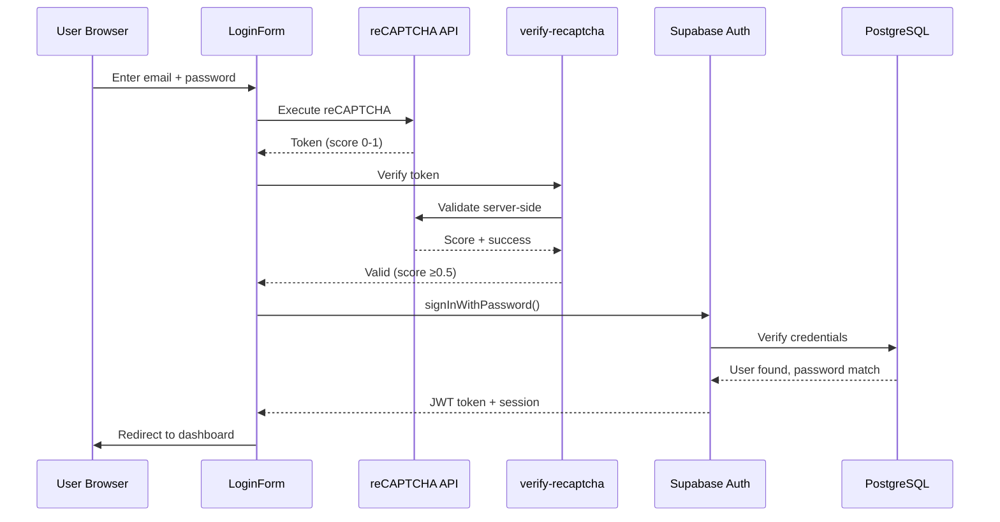

# Security & Compliance Guide

## Security Architecture

Inner Odyssey implements a multi-layered defense-in-depth security strategy to protect sensitive child data (COPPA/FERPA compliance) and prevent unauthorized access.

---

## Multi-Layered Defense Strategy

### Layer 1: Network Security
- **HTTPS Only:** No HTTP fallback, all traffic encrypted with TLS 1.3
- **Cloudflare DDoS Protection:** Edge-level attack mitigation
- **Rate Limiting:** Edge-level request throttling
- **WAF Rules:** Web Application Firewall blocks known attack patterns

### Layer 2: Authentication
- **Supabase Auth:** JWT-based authentication with secure token storage
- **reCAPTCHA v3:** Bot prevention on auth forms (score-based, invisible)
- **Auto Token Refresh:** Tokens refresh every 60 minutes automatically
- **Secure Password Hashing:** bcrypt with 10 rounds (industry standard)

### Layer 3: Authorization
- **Row Level Security (RLS):** Database-level access control (primary defense)
- **RBAC:** Role-Based Access Control (parent, admin, moderator)
- **Server-Side Validation:** Always verify ownership (never trust client)
- **Least Privilege:** Users can only access data they own

### Layer 4: Application Security
- **Input Sanitization:** All user inputs sanitized before processing
- **XSS Prevention:** DOMPurify for HTML, escape for text
- **SQL Injection Prevention:** Parameterized queries only (no raw SQL)
- **Rate Limiting:** Client + server rate limiting for abuse prevention

### Layer 5: Audit & Monitoring
- **Access Logging:** Sensitive table access logged to `security_access_log`
- **Security Dashboard:** Real-time monitoring of violations
- **Incident Response:** Automated alerts for critical issues
- **Audit Trail:** Immutable logs for compliance

---

## Authentication & Authorization

### Authentication Flow



**Steps:**
1. User submits email + password → `LoginForm.tsx`
2. reCAPTCHA v3 executes (invisible, score-based)
3. Frontend calls `verify-recaptcha` edge function
4. Edge function validates token with Google API
5. If score ≥0.5, proceed to Supabase Auth
6. Supabase validates credentials (bcrypt hash comparison)
7. JWT token returned + stored in localStorage
8. Token attached to all subsequent requests (Authorization header)
9. Token auto-refreshed every 60 minutes

---

### Authorization (RBAC)

**Roles:**
- **parent:** Default role for all users, can manage own children
- **moderator:** Can review user-generated content, view reports
- **admin:** Full system access, can assign roles, view all data

**Hierarchy:** `admin > moderator > parent`

**Storage:** `user_roles` table with optional `expires_at`

**Validation Functions:**
- `has_role(user_id, role)` - Check if user has specific role
- `has_permission(user_id, required_role)` - Check permission with hierarchy
- `is_current_user_admin()` - Simplified admin check for RLS policies

**Example RLS Policy:**
```sql
-- Only admins can view security logs
CREATE POLICY admin_only ON security_access_log
FOR SELECT
USING (is_current_user_admin());
```

---

### Child Selection Security

Child selection is a critical security boundary. Attackers could manipulate `localStorage` to access other children's data.

❌ **INSECURE (Never Do This):**
```typescript
// Directly trust localStorage (SECURITY VULNERABILITY)
const childId = localStorage.getItem('selectedChildId');

// Use childId without validation
const { data } = await supabase
  .from('user_progress')
  .select('*')
  .eq('child_id', childId);
```

**Attack Vector:** Attacker opens DevTools, sets `localStorage.setItem('selectedChildId', 'victim-child-id')`, gains access to victim's data.

✅ **SECURE (Always Do This):**
```typescript
// Server-side validation via RLS
const { childId, isValidating } = useValidatedChild();

if (isValidating) {
  return <LoadingSpinner />;
}

if (!childId) {
  return <div>No child selected. Please select a child.</div>;
}

// Now safe to use childId (ownership verified)
const { data } = await supabase
  .from('user_progress')
  .select('*')
  .eq('child_id', childId);
```

**How `useValidatedChild()` Works:**
1. Read `childId` from localStorage
2. Query database: `SELECT id FROM children WHERE id=? AND parent_id=auth.uid()`
3. RLS policy enforces `parent_id = auth.uid()`
4. If query returns no rows, childId is invalid (not owned by user)
5. Clear localStorage and redirect to child selector
6. If valid, return childId for use

**Implementation:**
```typescript
// src/hooks/useValidatedChild.tsx
export const useValidatedChild = () => {
  const [childId, setChildId] = useState<string | null>(null);
  const [isValidating, setIsValidating] = useState(true);
  const { user } = useAuth();
  const navigate = useNavigate();

  useEffect(() => {
    const validateChild = async () => {
      if (!user) {
        setChildId(null);
        setIsValidating(false);
        return;
      }

      const storedChildId = localStorage.getItem('selectedChildId');
      
      if (!storedChildId) {
        setChildId(null);
        setIsValidating(false);
        return;
      }

      // Server-side validation via RLS
      const { data, error } = await supabase
        .from('children')
        .select('id')
        .eq('id', storedChildId)
        .eq('parent_id', user.id) // RLS enforces this, but explicit for clarity
        .single();

      if (error || !data) {
        // Invalid child ID - clear it
        localStorage.removeItem('selectedChildId');
        setChildId(null);
        navigate('/');
      } else {
        setChildId(data.id);
      }
      
      setIsValidating(false);
    };

    validateChild();
  }, [user, navigate]);

  return { childId, isValidating };
};
```

---

## Row Level Security (RLS)

RLS is the **primary defense** against unauthorized data access. It's enforced at the PostgreSQL level, making it impossible to bypass from the application.

### Standard Patterns

**Pattern 1: Parent-Child Ownership**
```sql
-- Parents can only access their own children
CREATE POLICY parent_access ON children
FOR ALL
USING (parent_id = auth.uid());
```

**Pattern 2: Admin Override**
```sql
-- Parents access own data, admins access all
CREATE POLICY parent_or_admin ON children
FOR SELECT
USING (
  (parent_id = auth.uid()) OR has_role(auth.uid(), 'admin')
);
```

**Pattern 3: Child Data Through Parent**
```sql
-- Parents can access data for their children only
CREATE POLICY child_data_access ON user_progress
FOR ALL
USING (
  child_id IN (
    SELECT id FROM children WHERE parent_id = auth.uid()
  )
);
```

**Pattern 4: Public Read, Authenticated Write**
```sql
-- Anyone can view, only authenticated can modify
CREATE POLICY public_read ON lessons
FOR SELECT
USING (is_active = true);

CREATE POLICY authenticated_write ON lessons
FOR INSERT
WITH CHECK (auth.uid() IS NOT NULL);
```

---

### Testing RLS Policies

**Method 1: Impersonate User (SQL Editor)**
```sql
-- Impersonate user
SET request.jwt.claims = '{"sub": "user-uuid-here"}';

-- Test query (should only return authorized data)
SELECT * FROM children;
-- Should return only children owned by user-uuid-here

-- Reset
RESET request.jwt.claims;
```

**Method 2: Create Test Accounts**
1. Create 2 parent accounts (Parent A, Parent B)
2. Parent A creates Child A
3. Parent B creates Child B
4. Log in as Parent A
5. Attempt to access Child B's data
6. Should fail (403 Forbidden or empty result)

**Method 3: Automated Testing**
```typescript
// Create test suite with Jest + Supabase
describe('RLS Policy Tests', () => {
  it('should prevent parent from accessing other parent\'s children', async () => {
    // Login as Parent A
    const { data: { session: sessionA } } = await supabase.auth.signInWithPassword({
      email: 'parentA@test.com',
      password: 'password123'
    });

    // Attempt to access Parent B's child
    const { data, error } = await supabase
      .from('children')
      .select('*')
      .eq('id', 'parent-b-child-id');

    // Should return empty array (RLS blocks access)
    expect(data).toEqual([]);
    expect(error).toBeNull();
  });
});
```

---

### Common RLS Mistakes

**Mistake 1: Forgetting RLS on New Tables**
```sql
-- ❌ BAD: Table created without RLS = publicly accessible!
CREATE TABLE dangerous_table (
  id uuid PRIMARY KEY,
  secret text NOT NULL
);

-- Anyone can access this table, even unauthenticated users!

-- ✅ FIX: Always enable RLS on new tables
ALTER TABLE dangerous_table ENABLE ROW LEVEL SECURITY;

-- Create restrictive policy (deny all by default)
CREATE POLICY deny_all ON dangerous_table
FOR ALL
USING (false);

-- Then add specific access policies
CREATE POLICY owner_only ON dangerous_table
FOR ALL
USING (user_id = auth.uid());
```

**Mistake 2: Overly Permissive Policies**
```sql
-- ❌ BAD: Allows anyone to access all data
CREATE POLICY public_access ON sensitive_table
FOR ALL
USING (true);

-- ✅ GOOD: Restrict to owner
CREATE POLICY owner_only ON sensitive_table
FOR ALL
USING (user_id = auth.uid());
```

**Mistake 3: Using Foreign Keys to auth.users**
```sql
-- ❌ BAD: Foreign key to auth.users (managed by Supabase, can't query)
CREATE TABLE profiles (
  id uuid PRIMARY KEY REFERENCES auth.users(id)
);

-- ✅ GOOD: Use user ID directly, no foreign key
CREATE TABLE profiles (
  id uuid PRIMARY KEY -- Matches auth.users.id, but no FK constraint
);
```

---

## Input Sanitization

All user input must be sanitized before processing to prevent XSS, injection attacks, and other vulnerabilities.

### XSS Prevention

**Library:** DOMPurify (HTML sanitization)

**Usage:**
```typescript
import { sanitizeHTML, sanitizeMarkdown } from '@/lib/inputSanitization';

// User-submitted lesson content
const userContent = "<script>alert('XSS')</script><p>Hello</p>";

// Sanitize before displaying
const safeContent = sanitizeHTML(userContent);
// Output: "&lt;script&gt;alert('XSS')&lt;/script&gt;<p>Hello</p>"

// Display safely
return <div dangerouslySetInnerHTML={{ __html: safeContent }} />;
```

**Implementation:**
```typescript
// src/lib/inputSanitization.ts
import DOMPurify from 'dompurify';

export const sanitizeHTML = (dirty: string): string => {
  return DOMPurify.sanitize(dirty, {
    ALLOWED_TAGS: ['p', 'b', 'i', 'u', 'strong', 'em', 'h1', 'h2', 'h3', 'ul', 'ol', 'li', 'a'],
    ALLOWED_ATTR: ['href', 'title', 'target'],
    ALLOW_DATA_ATTR: false
  });
};

export const sanitizeMarkdown = (dirty: string): string => {
  // Remove dangerous markdown patterns
  let clean = dirty
    .replace(/javascript:/gi, '') // Remove javascript: protocol
    .replace(/data:/gi, '') // Remove data: protocol
    .replace(/<script/gi, '&lt;script'); // Escape script tags
  
  return clean;
};
```

---

### Email Validation

```typescript
import { sanitizeEmail } from '@/lib/inputSanitization';

// Validate and sanitize email
try {
  const email = sanitizeEmail(userInput);
  // Email is valid and sanitized
} catch (error) {
  // Invalid email format
  toast.error('Invalid email address');
}
```

**Implementation:**
```typescript
export const sanitizeEmail = (email: string): string => {
  const trimmed = email.trim().toLowerCase();
  
  // Validate email format
  const emailRegex = /^[^\s@]+@[^\s@]+\.[^\s@]+$/;
  if (!emailRegex.test(trimmed)) {
    throw new Error('Invalid email format');
  }
  
  // Check for dangerous characters
  if (/[<>'"\/\\]/.test(trimmed)) {
    throw new Error('Email contains invalid characters');
  }
  
  return trimmed;
};
```

---

### URL Validation

```typescript
import { sanitizeURL } from '@/lib/inputSanitization';

// Validate and sanitize URL
const url = sanitizeURL(userInput);
// Returns "#" if dangerous, otherwise returns validated URL
```

**Implementation:**
```typescript
export const sanitizeURL = (url: string): string => {
  // Block dangerous protocols
  if (/^(javascript|data|vbscript|file|about):/i.test(url)) {
    return '#'; // Safe fallback
  }
  
  // Only allow HTTP(S)
  if (!/^https?:\/\//i.test(url)) {
    return '#';
  }
  
  return url;
};
```

---

## Rate Limiting

Rate limiting prevents abuse by limiting the number of requests a user can make within a time window.

### Edge Function Rate Limiting Middleware

All edge functions should use the centralized rate limiting middleware:

```typescript
import { rateLimitMiddleware } from '../_shared/rateLimitMiddleware.ts';

serve(async (req) => {
  // Handle CORS
  if (req.method === 'OPTIONS') {
    return new Response(null, { headers: corsHeaders });
  }

  // Apply rate limiting
  const rateLimitResponse = await rateLimitMiddleware(req, {
    maxRequests: 10,
    windowMinutes: 60,
    endpoint: 'my-function'
  });
  
  if (rateLimitResponse) return rateLimitResponse;
  
  // ... rest of function logic
});
```

This middleware automatically:
- Validates JWT tokens
- Checks rate limits via database RPC
- Logs violations to `rate_limit_violations` table
- Returns proper 429 responses with `Retry-After` headers

### Client-Side Rate Limiting

**Purpose:** Provide immediate feedback to user before hitting server

**Usage:**
```typescript
import { checkRateLimit, RATE_LIMITS } from '@/lib/rateLimiter';

const handleLogin = async () => {
  // Check rate limit
  const isLimited = checkRateLimit({
    identifier: `login:${email}`,
    maxRequests: 5,
    windowMs: 15 * 60 * 1000 // 15 minutes
  });

  if (isLimited) {
    toast.error('Too many login attempts. Please try again in 15 minutes.');
    return;
  }

  // Proceed with login
  await supabase.auth.signInWithPassword({ email, password });
};
```

**Implementation:**
```typescript
// src/lib/rateLimiter.ts
interface RateLimitCheck {
  identifier: string;
  maxRequests: number;
  windowMs: number;
}

export const checkRateLimit = ({ identifier, maxRequests, windowMs }: RateLimitCheck): boolean => {
  const now = Date.now();
  const key = `rate_limit:${identifier}`;
  
  // Get existing data
  const data = localStorage.getItem(key);
  let attempts: number[] = data ? JSON.parse(data) : [];
  
  // Remove expired attempts
  attempts = attempts.filter(timestamp => now - timestamp < windowMs);
  
  // Check if limit exceeded
  if (attempts.length >= maxRequests) {
    return true; // Rate limited
  }
  
  // Add new attempt
  attempts.push(now);
  localStorage.setItem(key, JSON.stringify(attempts));
  
  return false; // Not rate limited
};
```

---

### Server-Side Rate Limiting

**Purpose:** Enforce limits at database level (cannot be bypassed by client)

**Usage:**
```typescript
import { checkServerRateLimit, RATE_LIMITS } from '@/lib/rateLimiter';

// In edge function
const { allowed, retryAfter, remaining } = await checkServerRateLimit(
  RATE_LIMITS.LESSON_GENERATION.endpoint,
  RATE_LIMITS.LESSON_GENERATION.maxRequests,
  RATE_LIMITS.LESSON_GENERATION.windowMinutes
);

if (!allowed) {
  return new Response(JSON.stringify({
    error: 'Rate limit exceeded',
    retry_after_seconds: retryAfter,
    remaining: 0
  }), { 
    status: 429,
    headers: { ...corsHeaders, 'Content-Type': 'application/json' }
  });
}
```

**Implementation:**
```typescript
// Calls check_rate_limit() database function
export const checkServerRateLimit = async (
  endpoint: string,
  maxRequests: number,
  windowMinutes: number
): Promise<{ allowed: boolean; retryAfter: number; remaining: number }> => {
  const { data, error } = await supabase.rpc('check_rate_limit', {
    p_user_id: user.id,
    p_endpoint: endpoint,
    p_max_requests: maxRequests,
    p_window_minutes: windowMinutes
  });

  if (error) throw error;

  return {
    allowed: data.allowed,
    retryAfter: data.retry_after_seconds || 0,
    remaining: data.remaining || 0
  };
};
```

---

### Rate Limit Configurations

| Endpoint | Limit | Window | Storage | Enforced |
|----------|-------|--------|---------|----------|
| **Login** | 5 attempts | 15 min | Database | Server |
| **Signup** | 3 attempts | 60 min | Database | Server |
| **Password Reset** | 3 attempts | 60 min | Database | Server |
| **Custom Lesson Gen** | 3 lessons | 24 hours | Database | Server (edge function) |
| **Collaboration Requests** | 10 requests | 15 min | Database | Server (DB function) |
| **Beta Feedback** | 5 submissions | 24 hours | Client | Client |

---

## Audit Logging

Audit logging tracks access to sensitive data for COPPA/FERPA compliance and security monitoring.

### What Gets Logged

**Sensitive Tables:**
- `emotion_logs` - Mental health data (highly sensitive)
- `parent_child_messages` - Private communications
- `children` - Child PII (name, grade, avatar)
- `user_progress` - Educational records (FERPA protected)

**Access Types:**
- `view` - SELECT queries
- `insert` - INSERT operations
- `update` - UPDATE operations
- `delete` - DELETE operations

---

### How to Log Access

**Manual Logging:**
```typescript
import { logEmotionLogView, logChildDataView } from '@/lib/auditLogger';

// When parent views child's emotion logs
await logEmotionLogView(emotionLogId, childId);

// When parent views child profile
await logChildDataView(childId);
```

**Automatic Logging:**
```sql
-- Database trigger automatically logs INSERT/UPDATE/DELETE
CREATE TRIGGER log_emotion_access
AFTER INSERT OR UPDATE OR DELETE ON emotion_logs
FOR EACH ROW
EXECUTE FUNCTION trigger_log_access();
```

---

### Viewing Audit Logs

**Admin Dashboard → Security Monitoring:**
1. Navigate to `/security-monitoring`
2. View recent access logs
3. Filter by:
   - User ID
   - Table name
   - Access type
   - Date range
   - Success/failure
4. Export CSV for compliance audits

**SQL Query:**
```sql
-- View all emotion log access in last 24 hours
SELECT 
  accessed_at,
  user_id,
  accessed_table,
  access_type,
  success
FROM security_access_log
WHERE accessed_table = 'emotion_logs'
  AND accessed_at > NOW() - INTERVAL '24 hours'
ORDER BY accessed_at DESC;
```

---

### Audit Log Schema

```typescript
interface SecurityAccessLog {
  id: string;
  user_id: string;
  accessed_table: string;
  accessed_record_id: string | null;
  access_type: 'view' | 'insert' | 'update' | 'delete';
  ip_address: string | null;
  user_agent: string | null;
  success: boolean;
  error_message: string | null;
  metadata: Record<string, any>;
  accessed_at: Date;
}
```

---

## Data Encryption

### Emotion Log Encryption (E2E)

Emotion logs contain highly sensitive mental health data and are encrypted end-to-end.

**Why:** Even database administrators should not be able to read emotion logs without the user's encryption key.

**How It Works:**
1. Parent sets encryption key (stored in memory only, never in database)
2. Emotion data encrypted before insert using PostgreSQL `pgcrypto` extension
3. Stored as `bytea` (binary) in database
4. Decrypted on read using same key
5. If parent forgets key, data is permanently inaccessible (by design)

**Key Derivation:**
```typescript
// src/lib/emotionEncryption.ts
const getEncryptionKey = async (): Promise<string> => {
  const { data: { session } } = await supabase.auth.getSession();
  if (!session?.access_token) {
    throw new Error('No active session');
  }
  
  // Use first 32 characters of access token as encryption key
  // This ensures key is unique per session and never stored
  return session.access_token.slice(0, 32);
};
```

**Encryption:**
```typescript
// Encrypt emotion data before insert
const { data: encryptedTrigger } = await supabase.rpc('encrypt_emotion_field', {
  plaintext: 'Child felt anxious about upcoming test',
  encryption_key: await getEncryptionKey()
});

await supabase.from('emotion_logs').insert({
  child_id: childId,
  emotion_type: 'anxious',
  trigger_encrypted: encryptedTrigger,
  ...
});
```

**Decryption:**
```typescript
// Decrypt emotion data on read
const { data: logs } = await supabase
  .from('emotion_logs')
  .select('*')
  .eq('child_id', childId);

for (const log of logs) {
  const { data: decryptedTrigger } = await supabase.rpc('decrypt_emotion_field', {
    ciphertext: log.trigger_encrypted,
    encryption_key: await getEncryptionKey()
  });
  
  log.trigger = decryptedTrigger;
}
```

**Security Properties:**
- **E2E Encryption:** Data encrypted in browser, decrypted in browser
- **No Plaintext Storage:** Database only stores encrypted bytea
- **Key Not Stored:** Encryption key derived from session token, never persisted
- **Audit Trail:** All access logged to `security_access_log`

---

## COPPA Compliance (Children's Privacy)

**Law:** Children's Online Privacy Protection Act (US)  
**Applies To:** Websites/apps collecting data from children under 13

### Requirements

1. **Parental Consent:** Obtain verifiable parental consent before collecting child data
2. **Privacy Notice:** Provide clear notice of data collection practices
3. **Data Minimization:** Collect only necessary data
4. **Right to Access:** Parents can view all data collected about their child
5. **Right to Deletion:** Parents can delete all child data
6. **No Behavioral Advertising:** No targeted ads to children
7. **Third-Party Disclosure:** Disclose all third-party data sharing

---

### Implementation

**1. Parental Consent (Signup Flow)**
```typescript
// SignupForm.tsx
<Checkbox
  id="coppa-consent"
  checked={coppaConsent}
  onCheckedChange={setCoppaConsent}
  required
/>
<label htmlFor="coppa-consent">
  I am the parent/guardian of the child(ren) I will add to this account. 
  I consent to the collection of my child's information as described in our 
  <a href="/privacy">Privacy Policy</a>.
</label>
```

**2. Privacy Notice**
- Comprehensive privacy policy at `/privacy`
- Plain language explanation of data collection
- Contact information for privacy questions
- Dated and versioned (updated whenever practices change)

**3. Data Minimization**
- ✅ Collect: Name (first name only), grade level, avatar config, progress data
- ❌ Don't Collect: Last name, email, phone, location, biometric, social security

**4. Right to Access**
```typescript
// ParentDashboard.tsx - "Export Child Data" button
const exportChildData = async (childId: string) => {
  // Fetch all data for child
  const [progress, badges, messages, emotions] = await Promise.all([
    supabase.from('user_progress').select('*').eq('child_id', childId),
    supabase.from('user_badges').select('*').eq('child_id', childId),
    supabase.from('parent_child_messages').select('*').eq('child_id', childId),
    supabase.from('emotion_logs').select('*').eq('child_id', childId)
  ]);
  
  // Export as JSON
  const exportData = { progress, badges, messages, emotions };
  const blob = new Blob([JSON.stringify(exportData, null, 2)], { type: 'application/json' });
  const url = URL.createObjectURL(blob);
  
  // Download
  const a = document.createElement('a');
  a.href = url;
  a.download = `child-data-${childId}.json`;
  a.click();
};
```

**5. Right to Deletion**
```typescript
// ParentDashboard.tsx - "Delete Child Account" button
const deleteChild = async (childId: string) => {
  // Confirm with parent
  const confirmed = await confirmDialog({
    title: 'Delete Child Account?',
    message: 'This will permanently delete all data for this child. This cannot be undone.'
  });
  
  if (!confirmed) return;
  
  // Cascading delete removes all related data
  const { error } = await supabase
    .from('children')
    .delete()
    .eq('id', childId);
  
  if (error) {
    toast.error('Failed to delete child account');
  } else {
    toast.success('Child account deleted successfully');
  }
};
```

**6. No Behavioral Advertising**
- No ad network integrations
- No tracking pixels
- No behavioral analytics
- No third-party cookies

**7. Third-Party Disclosure**
- Supabase (data storage, authentication)
- Lovable AI (lesson generation only, no PII sent)
- Cloudflare (CDN, DDoS protection)
- No data sales to third parties

---

## FERPA Compliance (Educational Records)

**Law:** Family Educational Rights and Privacy Act (US)  
**Applies To:** Educational institutions and apps with educational records

### Requirements

1. **Parent Access:** Parents have right to inspect and review child's educational records
2. **Amendment Rights:** Parents can request corrections to inaccurate records
3. **Consent for Disclosure:** Explicit consent required before disclosing records to third parties
4. **Security:** Maintain reasonable safeguards to protect records
5. **Directory Information:** Distinguish between directory info (can share) and protected info (cannot share)

---

### Implementation

**1. Parent Access**
- Parents have full read access via ParentDashboard
- Can view all progress, scores, badges, lessons
- Can export all educational records (CSV/JSON)

**2. Amendment Rights**
```typescript
// Not implemented yet - future feature
// Allow parents to request corrections to inaccurate lesson scores
const requestCorrection = async (progressId: string, reason: string) => {
  await supabase.from('correction_requests').insert({
    progress_id: progressId,
    reason: reason,
    status: 'pending'
  });
  
  toast.success('Correction request submitted for review');
};
```

**3. Consent for Disclosure**
- Lesson sharing requires explicit parent approval
- No automatic sharing of progress data
- No third-party integrations without consent

**4. Security Safeguards**
- RLS policies prevent unauthorized access
- Audit logging tracks all access
- Encrypted emotion logs
- Rate limiting prevents abuse
- Regular security audits

**5. Directory vs Protected Information**
| Directory (Shareable) | Protected (Not Shareable) |
|----------------------|---------------------------|
| Child's first name | Last name |
| Grade level | Date of birth |
| Badges earned | Lesson scores |
| Avatar | Emotion logs |

---

## reCAPTCHA Integration

Protects authentication forms from bot attacks and credential stuffing.

### Setup

1. **Get Keys:** https://www.google.com/recaptcha/admin/create
2. **Type:** reCAPTCHA v3 (invisible, score-based)
3. **Domains:** innerodyssey.com, *.innerodyssey.com, localhost
4. **Keys:**
   - **Site Key:** Add to `src/hooks/useRecaptcha.tsx`
   - **Secret Key:** Add to Lovable Cloud Secrets (`RECAPTCHA_SECRET_KEY`)

---

### Client-Side Usage

```typescript
import { useRecaptcha } from '@/hooks/useRecaptcha';

const LoginForm = () => {
  const { executeRecaptcha } = useRecaptcha();

  const handleLogin = async () => {
    // Execute reCAPTCHA (invisible)
    const token = await executeRecaptcha('login');
    
    // Verify server-side
    const { data } = await supabase.functions.invoke('verify-recaptcha', {
      body: { token, action: 'login' }
    });
    
    if (!data.success || data.score < 0.5) {
      toast.error('Security check failed. Please try again.');
      return;
    }
    
    // Proceed with login
    await supabase.auth.signInWithPassword({ email, password });
  };

  return <Button onClick={handleLogin}>Log In</Button>;
};
```

---

### Server-Side Verification

```typescript
// supabase/functions/verify-recaptcha/index.ts
const RECAPTCHA_SECRET_KEY = Deno.env.get('RECAPTCHA_SECRET_KEY');
const { token } = await req.json();

const response = await fetch('https://www.google.com/recaptcha/api/siteverify', {
  method: 'POST',
  headers: { 'Content-Type': 'application/x-www-form-urlencoded' },
  body: `secret=${RECAPTCHA_SECRET_KEY}&response=${token}`
});

const result = await response.json();

// result.success: true/false
// result.score: 0.0-1.0 (v3 score)
// result.action: action name from client

return new Response(JSON.stringify({
  success: result.success && result.score >= 0.5,
  score: result.score,
  action: result.action
}), { headers: corsHeaders });
```

---

### Score Thresholds

| Score Range | Interpretation | Action |
|-------------|----------------|---------|
| 0.0-0.3 | Likely bot | Block |
| 0.3-0.5 | Suspicious | Challenge or block |
| 0.5-0.7 | Likely human | Allow with monitoring |
| 0.7-1.0 | Very likely human | Allow |

---

## Security Monitoring

### Admin Dashboard

**Route:** `/security-monitoring`  
**Access:** Admin only (`has_role(auth.uid(), 'admin')`)

**Features:**
- Unauthorized access attempts
- Rate limit violations
- Failed authentication logs
- Suspicious activity patterns
- Real-time alerts

**Queries:**
```typescript
// Get recent unauthorized access attempts
const { data: violations } = await supabase
  .from('security_access_log')
  .select('*')
  .eq('success', false)
  .order('accessed_at', { ascending: false })
  .limit(100);

// Get rate limit violations in last 24 hours
const { data: rateLimits } = await supabase
  .from('rate_limit_violations')
  .select('*')
  .gte('created_at', new Date(Date.now() - 24 * 60 * 60 * 1000).toISOString())
  .order('created_at', { ascending: false });
```

---

### Alert Thresholds

**Critical (Immediate Action):**
- 5+ failed auth attempts in 5 minutes (same user)
- Unauthorized access to sensitive tables (emotion_logs)
- SQL injection attempt detected
- XSS attempt detected

**High (Review Within 1 Hour):**
- 3+ rate limit violations in 1 hour (same user)
- Unusual access pattern (100+ requests in 1 minute)
- Multiple failed RLS policy checks

**Medium (Review Within 24 Hours):**
- Failed authentication attempt
- Rate limit exceeded
- Low reCAPTCHA score (0.3-0.5)

**Low (Monitor Trends):**
- Normal failed access (wrong password once)
- Single rate limit violation
- High reCAPTCHA score but flagged for review

---

## Security Checklist for New Features

Before deploying any new feature:

**Database:**
- [ ] RLS policies created and tested
- [ ] No tables left without RLS
- [ ] Policies tested with multiple users
- [ ] Foreign key constraints in place
- [ ] Indexes created for filtered queries

**Authentication:**
- [ ] User authentication required
- [ ] Ownership validation (never trust client)
- [ ] Child selection validated server-side
- [ ] Admin-only features protected

**Input Validation:**
- [ ] All user input sanitized
- [ ] SQL injection prevented (parameterized queries)
- [ ] XSS prevented (DOMPurify)
- [ ] Email validation
- [ ] URL validation

**Rate Limiting:**
- [ ] Client-side rate limiting implemented
- [ ] Server-side rate limiting implemented
- [ ] Clear error messages with retry time
- [ ] Rate limit violations logged

**Audit Logging:**
- [ ] Sensitive data access logged
- [ ] Admin actions logged
- [ ] No PII in logs

**Edge Functions:**
- [ ] CORS headers configured
- [ ] Authentication check implemented
- [ ] Ownership validation
- [ ] Error messages don't leak sensitive info
- [ ] Secrets in environment variables (never hardcoded)

**Testing:**
- [ ] Tested with different user roles
- [ ] Tested with invalid/malicious input
- [ ] Tested RLS policies with multiple accounts
- [ ] Security scan (OWASP ZAP)

---

## Incident Response Plan

### Detection

**Automated Alerts:**
- Critical security violations trigger immediate alerts
- Admin dashboard shows real-time violations
- Email notifications for critical issues

**Manual Detection:**
- Weekly security log review
- Monthly audit of RLS policies
- Quarterly penetration testing

---

### Immediate Response (Within 1 Hour)

1. **Identify Scope:**
   - Which users affected?
   - What data was accessed?
   - How long has breach occurred?

2. **Block Attacker:**
   - Add IP to blocklist (if applicable)
   - Revoke compromised access tokens
   - Disable compromised accounts

3. **Patch Vulnerability:**
   - Deploy fix immediately
   - Run security scan to verify fix
   - Monitor for continued attacks

---

### User Notification (Within 72 Hours - GDPR Requirement)

**Email Template:**
```
Subject: Security Incident Notification

Dear [Parent Name],

We are writing to inform you of a security incident that may have affected your account.

WHAT HAPPENED:
[Brief description of incident]

WHAT DATA WAS AFFECTED:
[Specific data types: names, progress, etc.]

WHAT WE'RE DOING:
[Steps taken to fix and prevent]

WHAT YOU SHOULD DO:
[Recommended actions: change password, review account, etc.]

ADDITIONAL RESOURCES:
[Link to FAQ, contact support email]

We apologize for this incident and are committed to protecting your data.

Sincerely,
Inner Odyssey Security Team
```

**Required for PII Exposure:**
- If child names, progress data, or messages exposed
- Offer free credit monitoring (if applicable)
- Provide direct contact for questions

---

### Post-Incident

1. **Root Cause Analysis:**
   - What was the vulnerability?
   - How was it exploited?
   - Why wasn't it caught earlier?

2. **Update Security:**
   - Implement additional safeguards
   - Update security documentation
   - Add automated tests for this vulnerability

3. **Team Training:**
   - Share lessons learned
   - Update security checklist
   - Conduct security training

4. **Regulatory Reporting:**
   - FTC (COPPA violations)
   - State attorneys general (data breaches)
   - Document incident for compliance

---

## Security Resources

**External Resources:**
- OWASP Top 10: https://owasp.org/www-project-top-ten/
- Supabase Security: https://supabase.com/docs/guides/auth/row-level-security
- COPPA Compliance: https://www.ftc.gov/business-guidance/resources/childrens-online-privacy-protection-rule-not-just-kids-sites
- FERPA Guidance: https://studentprivacy.ed.gov/ferpa
- reCAPTCHA Docs: https://developers.google.com/recaptcha/docs/v3

**Internal Contacts:**
- Security Lead: [email]
- Compliance Officer: [email]
- Legal: [email]

**Reporting Security Issues:**
- Email: security@innerodyssey.com
- Encrypted: [PGP public key]
- Bug Bounty: [URL] (when available)

**Emergency Contacts:**
- On-Call Security Engineer: [phone]
- Incident Response Team: [pager/slack channel]
